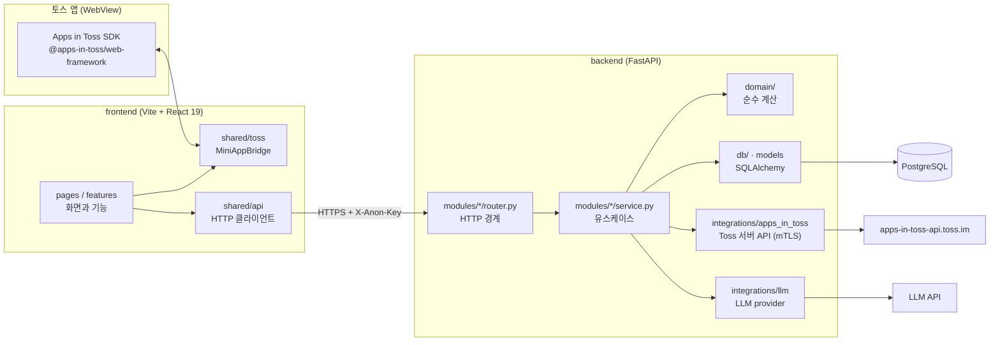
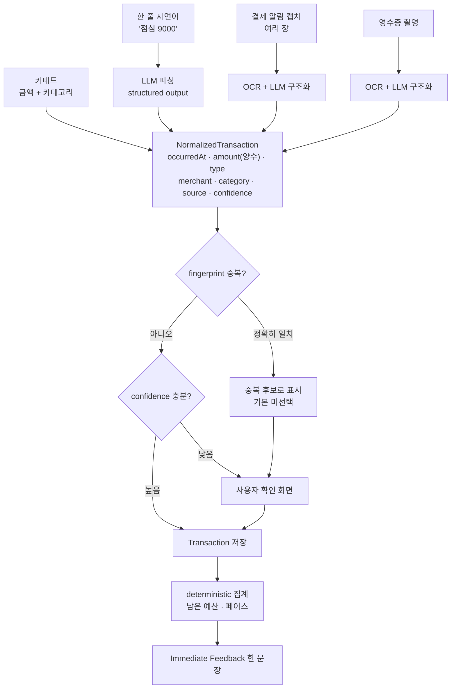

# 아키텍처

이 문서는 "무엇이 어디에 살고, 누가 누구를 부를 수 있는가"만 다룬다.
필드 정의는 `DATA_MODEL.md`, 엔드포인트는 `API_CONTRACT.md` 를 본다.

## 전체 그림



## 경계 네 개

### 1. 데이터는 FastAPI 한 곳으로만 들어간다

프론트는 DB 를 직접 보지 않는다. Supabase 클라이언트나 PostgreSQL 드라이버를 프론트에 넣지 않는다.
집계 규칙(남은 예산, 페이스, 중복 판정)이 프론트와 DB 양쪽에 흩어지면 두 곳이 서로 다른 숫자를 말하게 된다.
숫자를 만드는 자리를 백엔드 하나로 못 박아 두면, 화면은 받은 값을 그리기만 하면 된다.

### 2. Apps in Toss SDK 는 `frontend/src/shared/toss` 만 안다

화면이 `import { Device } from '@apps-in-toss/web-framework'` 를 쓰지 않는다.
`MiniAppBridge` 인터페이스(`shared/toss/types.ts`)만 알고, 실제 구현은 두 개다.

- `tossBridge.ts`: 실기기·샌드박스. SDK 를 부르고, 실패를 `BridgeError`(`UNSUPPORTED` / `PERMISSION_DENIED` / `CANCELLED` / `UNKNOWN`)로 바꿔 던진다.
- `mockBridge.ts`: 브라우저 개발과 테스트. 같은 계약을 만족하는 가짜다.

`createBridge()` 가 실행 환경을 보고 둘 중 하나를 고른다.
이 경계가 있어서 SDK 버전이 바뀌어도 고칠 자리가 한 폴더이고, 권한 거부·미지원 같은 엣지 상태를 브라우저에서 재현할 수 있다.
SDK 는 최소 토스 앱 버전 요구가 잦다(익명키 5.232.0, 광고 5.239.0, 앨범 5.261.0). 그 분기를 화면마다 흩어놓지 않으려면 한 곳이어야 한다.

### 3. Toss 서버 API 는 `backend/app/integrations/apps_in_toss` 만 부른다

익명 식별키 검증은 mTLS 클라이언트 인증서가 필요하고, 비즈니스 오류가 `HTTP 200 + resultType:"FAIL"` 로 온다.
상태코드만 보고 성공으로 판정하면 조용히 틀린다. 이 특수한 응답 해석을 한 모듈에 가둬 두고, 바깥에는 "검증 통과 여부"만 돌려준다.

인증서는 아직 없다. 그래서 검증기를 인터페이스로 두고 구현을 갈아 끼운다.

- `AnonKeyVerifier`: 계약
- `TossAnonKeyVerifier`: mTLS 실제 호출. 인증서가 생기면 바로 동작한다
- `TrustingAnonKeyVerifier`: 로컬 개발용. 검증 없이 통과시키되 운영 환경에서 켜지면 기동을 실패시킨다

### 4. LLM 은 `backend/app/integrations/llm` 만 부른다

AI 가 하는 일은 자연어 문장과 캡처 이미지를 구조화하는 것뿐이다. 금액 합계·예산 잔액·증감은 AI 가 만들지 않는다.
LLM 호출을 한 모듈에 가두면 (1) 프롬프트와 스키마 검증을 한 자리에서 보고, (2) 원문을 저장·로깅하지 않는 규칙을 한 곳에서 강제하고, (3) provider 를 바꿀 때 고칠 자리가 한 곳이다.

## 입력 네 경로가 하나로 모인다

기록 방법은 넷이지만, 저장 직전 형태는 `NormalizedTransaction` 하나다.



경로마다 다른 것은 `source`(`keypad` / `nl` / `screenshot` / `receipt` / `asset_screenshot` / `no_spend`)와 `confidence` 뿐이다.
그 뒤 중복 판정, 저장, 집계, 피드백은 완전히 같은 코드를 지난다.
새 입력 방법이 생겨도 정규화 함수 하나만 추가하면 되고, 집계 규칙을 다시 쓸 일이 없다.

## 프론트 폴더

```
src/
  app/        router · providers (앱을 조립하는 자리)
  pages/      라우트 하나 = 파일 하나
  features/   transactions · quick-record · imports · budgets · reports
              assets · goals · recovery · ads · settings
  shared/     ui · toss · api · tokens · lib
```

`features/` 끼리는 서로의 내부를 import 하지 않는다. 두 feature 가 같은 것을 필요로 하면 `shared/` 로 올린다.
올리는 기준은 "두 곳 이상에서 실제로 쓰고 있다"이고, 나중에 쓸 것 같아서 미리 올리지 않는다.

상태는 두 가지뿐이다. 서버에서 온 것은 TanStack Query, 화면 안에서만 사는 것은 `useState`.
Zustand 같은 전역 상태 라이브러리는 실제로 막히기 전에는 넣지 않는다. 서버 상태를 전역 스토어에 복사하면 두 벌이 되고 반드시 어긋난다.

## 백엔드 폴더

```
app/
  core/          설정 · 로깅 · 예외
  db/            세션 · 베이스 · 모델
  domain/        순수 계산 (예산 · 페이스 · 피드백 · 중복 fingerprint)
  api/           의존성 · 라우터 조립
  modules/       transactions · budgets · reports · assets · goals · imports · settings
  integrations/  apps_in_toss · llm
migrations/      alembic
tests/           domain · api
```

`domain/` 은 DB 도 HTTP 도 모른다. 값을 받아 값을 돌려주는 함수만 있다.
남은 예산, 하루 쓸 수 있는 돈, 페이스 비율, 피드백 단계 선택이 여기 산다.
가계부에서 사용자가 가장 크게 실망하는 것은 숫자가 틀리는 것이다. 이 계층을 얇고 순수하게 두면 pytest 로 경계값(말일, 월초 3일, 예산 0원, 환불로 지출이 음수가 되는 경우)을 전부 찍어볼 수 있다.

## 실행 환경 경계

- 프론트는 CSR 로만 빌드한다. SSR 은 플랫폼이 막는다. `eval`, iframe(YouTube 제외), `window.location.replace` 로 히스토리 조작 금지.
- 프론트 빌드 산출물은 `frontend/dist` 이고 `ait build` 가 `pocket.ait` 로 묶는다.
- 백엔드 CORS 는 실서비스 origin 네 개(`pocket.web.tossmini.com`, `pocket.private-web.tossmini.com`, `pocket.apps.tossmini.com`, `pocket.private-apps.tossmini.com`)와 로컬 `http://localhost:5173` 을 허용한다. 3.x 번들이 2.x origin 으로 서비스되는 기간이 있어 둘 다 필요하다.
- 서비스워커와 offline-first 는 쓰지 않는다. 오프라인 대비는 키패드 입력을 로컬 큐에 잠깐 담아 두는 것까지다.
