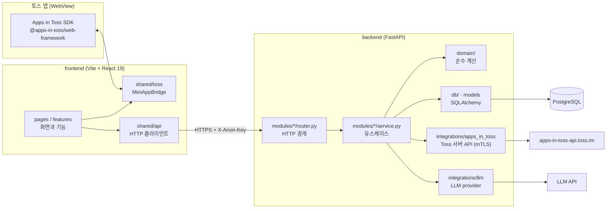
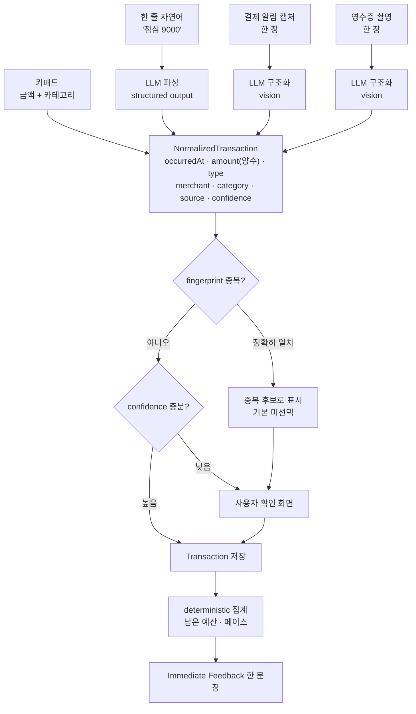

# 아키텍처

이 문서는 "무엇이 어디에 살고, 누가 누구를 부를 수 있는가"만 다룬다.
필드 정의는 `DATA_MODEL.md`, 엔드포인트는 `API_CONTRACT.md` 를 본다.

## 전체 그림



## 경계 네 개

### 1. 데이터는 FastAPI 한 곳으로만 들어간다

프론트는 DB 를 직접 보지 않는다. Supabase 클라이언트나 PostgreSQL 드라이버를 프론트에 넣지 않는다.
집계 규칙(남은 예산, 페이스, 중복 판정)이 프론트와 DB 양쪽에 흩어지면 두 곳이 서로 다른 숫자를 말하게 된다.
숫자를 만드는 자리를 백엔드 하나로 못 박아 두면, 화면은 받은 값을 그리기만 하면 된다.

### 2. Apps in Toss SDK 는 `frontend/src/shared/toss` 만 안다

화면이 `import { Device } from '@apps-in-toss/web-framework'` 를 쓰지 않는다.
`MiniAppBridge` 인터페이스(`shared/toss/types.ts`)만 알고, 실제 구현은 두 개다.

- `tossBridge.ts`: 실기기·샌드박스. SDK 를 부르고, 실패를 `BridgeError`(`UNSUPPORTED` / `PERMISSION_DENIED` / `CANCELLED` / `UNKNOWN`)로 바꿔 던진다.
- `mockBridge.ts`: 브라우저 개발과 테스트. 같은 계약을 만족하는 가짜다.

브릿지가 데리고 있는 것은 넷이다: `storage` · `ads` · `analytics` · `share`.
`share` 는 링크 만들기와 시스템 공유 시트 열기를 **한 번으로 묶는다.** 둘을 따로 열어 두면
링크만 만들고 시트를 못 연 상태가 생기는데, 그때 사용자에게는 아무 일도 안 일어난 것으로 보인다.

`createBridge()` 가 실행 환경을 보고 둘 중 하나를 고른다.
이 경계가 있어서 SDK 버전이 바뀌어도 고칠 자리가 한 폴더이고, 권한 거부·미지원 같은 엣지 상태를 브라우저에서 재현할 수 있다.
SDK 는 최소 토스 앱 버전 요구가 잦다(익명키 5.232.0, 광고 5.241.0). 그 분기를 화면마다 흩어놓지 않으려면 한 곳이어야 한다.

앨범에 붙은 5.261.0 은 `Device.getAlbumItems` 쪽 숫자다. **우리가 쓰는 `Device.getPhotos` 에는
버전 게이트가 없어서 `supports('albumPick')` 은 늘 true 다.** 그래서 캡처 탭의 미지원 화면 분기는
코드에 두되 실제로는 도달하지 않고, vitest 로만 본다.

### 3. Toss 서버 API 는 `backend/app/integrations/apps_in_toss` 만 부른다

익명 식별키 검증은 mTLS 클라이언트 인증서가 필요하고, 비즈니스 오류가 `HTTP 200 + resultType:"FAIL"` 로 온다.
상태코드만 보고 성공으로 판정하면 조용히 틀린다. 이 특수한 응답 해석을 한 모듈에 가둬 두고, 바깥에는 "검증 통과 여부"만 돌려준다.

인증서는 아직 없다. 그래서 검증기를 인터페이스로 두고 구현을 갈아 끼운다.

- `AnonKeyVerifier`: 계약
- `TossAnonKeyVerifier`: mTLS 실제 호출. 인증서가 생기면 바로 동작한다
- `TrustingAnonKeyVerifier`: 로컬 개발용. 검증 없이 통과시키되 운영 환경에서 켜지면 기동을 실패시킨다

### 4. LLM 은 `backend/app/integrations/llm` 만 부른다

AI 가 하는 일은 자연어 문장과 캡처 이미지를 구조화하는 것뿐이다. 금액 합계·예산 잔액·증감은 AI 가 만들지 않는다.
LLM 호출을 한 모듈에 가두면 (1) 프롬프트와 스키마 검증을 한 자리에서 보고, (2) 원문을 저장·로깅하지 않는 규칙을 한 곳에서 강제하고, (3) provider 를 바꿀 때 고칠 자리가 한 곳이다.

**캡처 바이트가 만들어지는 자리도 하나다.** data URL 을 푸는 것은 `app/api/images.py` 뿐이고,
형식·mime·크기·매직바이트 검사가 거기 모여 있다. 이미지는 파일로 쓰지 않아서 "요청이 끝나면
사라진다" 가 곧 삭제다. 그래서 "이미지가 어디까지 갔다 사라지나" 를 한 파일만 보면 답할 수
있다(ADR-0010).

## 입력 네 경로가 하나로 모인다

기록 방법은 넷이지만, 저장 직전 형태는 `NormalizedTransaction` 하나다.



경로마다 다른 것은 `source`(`keypad` / `nl` / `screenshot` / `receipt` / `asset_screenshot` / `no_spend`)와 `confidence` 뿐이다.
그 뒤 중복 판정, 저장, 집계, 피드백은 완전히 같은 코드를 지난다.
새 입력 방법이 생겨도 정규화 함수 하나만 추가하면 되고, 집계 규칙을 다시 쓸 일이 없다.

그림에서 읽어야 할 것 셋(ADR-0010).

- **OCR 단계를 따로 두지 않는다.** vision 모델이 이미지를 직접 읽어 구조화한다.
  중간에 원문 텍스트를 만들면 남기지 않기로 한 것이 하나 더 생긴다.
- **캡처는 한 번에 한 장이다.** PRD F4 는 여러 장을 적었지만 포트 `LlmStructuredClient.extract`
  가 이미지를 한 장만 받는다. 여러 장은 포트 계약을 넓히는 별건이다.
- **영수증도 같은 배관을 탄다.** 갈리는 것은 입구(카메라)와 모델에게 주는 지시뿐이고,
  자르기·중복 판정·상호 학습·검토 화면·저장은 캡처와 한 코드다.
  경로만 `POST /imports/receipt` 로 나눴다. 종류 필드로 합치면 필드를 안 보내도 캡처로
  조용히 돌아 저장까지 초록인 채 `source` 만 틀린다.

이미지 경로는 캡처와 영수증 둘이고, vision provider 가 없어 스텁이 정해 둔 예시를 낸다
(캡처 5건 · 영수증 1건). **인식 정확도는 아직 아무것도 증명되지 않았다.**

## 프론트 폴더

```
src/
  app/        router · providers (앱을 조립하는 자리)      ← 있다
  pages/      라우트 하나 = 파일 하나                      ← 있다
  shared/     ui · toss · tokens · lib                     ← 있다
  shared/api  HTTP 클라이언트 · 생성 타입 · 쿼리 훅        ← 있다
  features/   home · home-add · quick-record · ads
              transactions · budgets · imports · reports
              categories · tags · recurring · settings
              assets · goals · notifications · share       ← 있다
```

**`features/` 에는 지금 화면 열넷과 화면 아닌 것 둘이 있다.** 홈(`home`), 기록 시트
(`quick-record`), 배너 슬롯(`ads`), 내역·달력·수정(`transactions`), 관리 탭 예산 섹션
(`budgets`), 줄글·캡처·영수증 검토(`imports`), 월 리포트(`reports`), 카테고리 관리
(`categories`), 태그 관리(`tags`), 반복 지출(`recurring`), 앱 설정(`settings`),
자산(`assets`), 목표(`goals`), 알림 설정(`notifications`), 그리고 화면이 없는 둘,
친구에게 보내기(`share`) 와 홈 화면에 추가(`home-add`) 다.
`share` 는 자기 화면이 없다. 목표·예산·결산·홈 넷이 같은 버튼과 같은 문구를 쓰는 자리라
`ads` 처럼 부품만 모아 두고 부르는 쪽이 자기 화면에 끼운다. 자리마다 문구를 새로 적으면
같은 앱이 화면마다 다른 말을 하고, 「금액은 안 보낸다」 같은 약속이 한 자리에서만 지켜진다.
부품은 둘이다: 카드 안에 조용히 서는 `ShareButton` 과, 스스로 나타나 권하는 `ShareInviteCard`.
뒤엣것이 홈과 목표 화면 **양쪽**에 서기 때문에 홈 전용 스타일(`home-card__*`)에 기댈 수 없다.
`tags` 와 `recurring` 은 자기 관리 화면을 가지면서 **다른 화면에도 부품을 낸다.**
태그 칩 줄(`TagPicker`)은 저장 직후 화면과 수정 시트가, 태그 조각(`TagBreakdown`)은 리포트가
쓴다. 반복 지출의 「곧 나갈 돈」 카드는 홈에 선다. 설정하는 자리와 알려 주는 자리를 갈라 두는
것이 규칙이고, 색을 정하는 규칙만은 `shared/lib/tagColors.ts` 에 있다. 목록 한 줄
(`shared/ledger/LedgerRow`)도 태그 색을 그리는데, shared 가 features 를 가리킬 수는 없기 때문이다.
복구 카드는 `recovery` 폴더가 아니라 `home` 안에 있다. 홈 히어로와 같은 예산 응답을 보고
같은 자리에 뜨고 지는 카드라, 폴더를 갈라 두면 왜 떴는지 두 곳을 읽어야 한다.

**배너 자리는 일곱이고 이름이 다 다르다**(`home` · `report` · `report_bottom` · `manage` ·
`settings` · `assets` · `goal`). 리포트에만 둘인데, 자리 이름이 같으면 뒤에 붙는 쪽이
재요청 간격(`AdSlot` 의 `REQUEST_COOLDOWN_MS`)에 걸려 늘 접힌다. 로그에서도 못 가른다.
아래 배너는 **소비 탭에만** 선다. 수입 탭에는 아래에 아무것도 없어 화면 끝에 홀로 남는다.

**반복 지출 알림은 기록 알림과 같은 길로 나간다**(`modules/notifications/service.py`).
예고마다 몇 시에·며칠 전에 알릴지를 따로 갖지만 보내는 자리를 하나로 둬야 **하루 한 통**을
지킬 수 있다. 콘솔 템플릿이 고정이라 문구가 둘 다 같고, 무엇 때문에 왔는지는 앱에 들어온 뒤
홈 카드가 말한다. 켜 둔 사람의 반복 지출은 1분마다 도는 잡이 **한 번의 쿼리로** 모아 읽는다.

**홈에서 스스로 서는 권유 카드는 한 번에 하나다.** 누가 서고 누가 비키는지는 `HomePage` 한
곳에서 정한다. 순서는 밀린 내역 → 홈 화면 추가 → 저녁 알림 → 예산 제안 → 별점 → 공유다.
「곧 나갈 돈」 은 이 셈에서 뺀다. 권유가 아니라 오늘 돈이 빠져나간다는 사실이고 걸어 둔 사람에게만
뜬다. 그래서 최대는 사실 하나 + 권유 하나다.

둘까지 허용하던 규칙을 2026-09-22 에 하나로 좁혔다. **출시판을 쓴 사람이 보낸 화면에 밀린 내역·
홈 화면 추가·저녁 알림이 한꺼번에 서 있었다.** 규칙이 기록 버튼 **아래**만 세고 있었고, 그 위에
서는 밀린 내역 카드는 아무도 안 세고 있었던 것이 원인이다. 초록 버튼이 기록하기까지 넷이라
무엇을 눌러야 하는 화면인지 안 읽힌다.

예산 제안이 한 번뿐인 안내에 비킨다. **예산 제안은 안 사라지고 기다리지만 한 번뿐인
안내는 자리를 내주면 영영 안 뜨기 때문**이다. 닫은 표시는 기기에 남고
(`shared/lib/cardDismiss.ts`), 홈 추가·저녁 알림만 **다섯 번째 기록에서 한 번 더** 뜬다.
그 「두 번째 기회」 는 표(mark) 가 아니라 키를 따로 둬서 가른다. 표는 같은지 다른지만 보기 때문에
「1회차에서 닫았다」 와 「5회차에서 닫았다」 를 함께 기억하지 못한다.

**달을 넘길 때 화면이 안 움직이는 것도 규칙이다.** 불러오는 동안의 자리표시자는 다 그린 것과
**같은 높이**여야 한다(관리 예산 카드·달력 합계 띠). 달력 격자는 어느 달이든 여섯 줄로 못 박고,
리포트 본문은 `.report__slot` 이 자리를 잡는다. 「뜬다」 만 확인하는 단언은 이걸 못 잡는다.
`e2e/specs/steady-month.spec.ts` 가 위치를 재서 확인한다.
`imports` 의 후보 검토 화면(`ImportReview`)은 줄글·캡처·영수증 탭이 **같은 컴포넌트를 쓴다.**
복제해 두면 후보 줄 하나를 고칠 때마다 세 곳을 고쳐야 한다.
캡처 탭과 영수증 탭은 `ImageImportTab` 하나에 문구 표만 바꿔 끼운 둘이다.
feature 하나는 컴포넌트와 판정 함수, 그리고 화면 스펙 CSS 파일 하나(`<feature>.css`,
`index.css` 가 불러온다)를 함께 가진다.

### `shared/api` 안쪽

```
shared/api/
  schema.gen.ts   docs/openapi.json 에서 뽑은 타입. 손대지 않는다
  types.ts        생성 타입의 짧은 이름 (BudgetOut 처럼 서버 스키마 이름 그대로)
  baseUrl.ts      API 절대주소. 개발 기본값은 localhost:8000
  errors.ts       오류 봉투 파싱 · code 별 문구 · ApiError
  decimal.ts      금액·비율 문자열 → 숫자. 변환은 여기 한 곳뿐이다
  transport.ts    fetch 한 번. 헤더 · 제한 시간 · 204 · 오류 변환
  client.ts       엔드포인트 하나에 메서드 하나
  context.ts      useApiClient() · useApiReady()
  queryKeys.ts    queryKey 규약과 무효화 대상
  queries.ts      조회 훅 (카테고리 · 태그 · 반복 지출 · 설정 · 알림 설정 · 예산 · 예산 제안 · 거래 목록 · 기간 요약 · 달력 · 월 리포트 · 월 결산 · 자산 · 목표 · 기억한 분류)
  mutations.ts    변경 훅 (거래 · 예산 · 카테고리 한도 · 카테고리 · 태그 · 반복 지출 · 설정 · 알림 설정 · 자산 · 목표와 적립 · 줄글·캡처·영수증 분석과 검토·저장)
```

생성 타입은 **커밋한다.** CI 의 frontend 잡은 백엔드 없이 도는데 그때도 타입이 있어야 빌드된다.
대신 `npm run api:types` 로 다시 뽑아 `git diff --exit-code` 로 대조하는 게이트를 CI 에 뒀다.
백엔드 잡의 openapi 게이트와 짝이라, 스펙과 프론트 타입이 어긋난 채로는 머지되지 않는다.

**조회·변경 훅이 `features/` 가 아니라 `shared` 에 있는 이유**는 무효화 대상이 feature 경계를
넘기 때문이다. 예산 상태는 홈·기록·예산 설정이 같이 보고, 거래를 하나 저장하면 셋이 한꺼번에
낡는다. 키를 feature 마다 만들면 어느 한 곳이 반드시 빠진다.
지금 있는 조회 훅은 카테고리·설정·알림 설정·예산·예산 제안·목록·요약·달력·월 리포트·월 결산·
자산·목표·기억한 분류이고, 변경 훅은 거래 저장·수정·삭제·되돌리기, 예산 저장·삭제,
카테고리 한도 저장·삭제, 설정 저장, 알림 설정 저장, 자산 저장, 목표 만들기·고치기·지우기와
적립 더하기·지우기, 그리고 줄글·캡처·영수증 분석과 후보 고치기·저장·버리기, 기억한 분류
지우기다. 홈은 `useBudget` 과 `useTransactions` 로, 달력 화면은 `useSummary` 와
`useCalendar` 로 그린다.

익명 식별키는 클라이언트가 **게터로** 읽는다. 값으로 받으면 식별키가 도착할 때마다 인스턴스가
새로 만들어진다. 만드는 자리는 `app/providers/ApiProvider.tsx` 이고, 식별키가 아직 없거나
실패했으면 요청을 보내지 않고 `CLIENT_` 접두사가 붙은 우리 쪽 사유로 던진다.
서버 401 과 갈라 두어야 화면이 '업데이트 안내'와 '다시 시도'를 제대로 고른다.

`features/` 끼리는 서로의 내부를 import 하지 않는다. 두 feature 가 같은 것을 필요로 하면 `shared/` 로 올린다.
올리는 기준은 "두 곳 이상에서 실제로 쓰고 있다"이고, 나중에 쓸 것 같아서 미리 올리지 않는다.

상태는 두 가지뿐이다. 서버에서 온 것은 TanStack Query, 화면 안에서만 사는 것은 `useState`.
Zustand 같은 전역 상태 라이브러리는 실제로 막히기 전에는 넣지 않는다. 서버 상태를 전역 스토어에 복사하면 두 벌이 되고 반드시 어긋난다.

## 백엔드 폴더

```
app/
  core/              설정 · 로깅
  db/                세션 · 선언 베이스
  models/            SQLAlchemy ORM
  domain/            순수 계산 (예산 · 기간 · 페이스 · 피드백 · 중복 fingerprint · 기본 카테고리 · 생활비 제안 · 월 결산 · 알림 판정)
  api/               의존성 · 예외 변환 · 라우터 조립
    images.py        캡처 data URL 을 바이트로 푸는 유일한 자리 (ADR-0010)
  modules/           transactions · budgets · categories · reports
                     assets · goals · imports · settings
                     notifications · merchant_rules
    ledger.py        사용자 시간대 기준 기간·합계. 거래와 예산이 함께 읽는다
  integrations/      apps_in_toss · llm · notifications
migrations/          alembic
tests/               domain · api · integrations · 마이그레이션 스모크
```

**enum 정본은 `domain` 이다.** `TransactionType` · `TransactionSource` 는 `domain/aggregation.py`,
`CategoryKind` 와 기본 카테고리는 `domain/categories.py`, `AssetGroup` 은 `domain/assets.py` 에 있고
`models` 와 API 스키마가 그것을 가져다 쓴다. 같은 값 목록을 두 곳에 적지 않는다.

금액 컬럼 타입은 `db/base.py` 의 `MoneyColumn` 이고, 계산에 쓰는 값 객체는 `domain/money.py` 의
`Money` 다. 이름이 겹치지 않게 컬럼 쪽에 `Column` 을 붙였다.

`domain/` 은 DB 도 HTTP 도 모른다. 값을 받아 값을 돌려주는 함수만 있다.
남은 예산, 하루 쓸 수 있는 돈, 페이스 비율, 피드백 단계 선택이 여기 산다.
가계부에서 사용자가 가장 크게 실망하는 것은 숫자가 틀리는 것이다. 이 계층을 얇고 순수하게 두면 pytest 로 경계값(말일, 월초 3일, 예산 0원, 환불로 지출이 음수가 되는 경우)을 전부 찍어볼 수 있다.

## 실행 환경 경계

- 프론트는 CSR 로만 빌드한다. SSR 은 플랫폼이 막는다. `eval`, iframe(YouTube 제외), `window.location.replace` 로 히스토리 조작 금지.
- 프론트 빌드 산출물은 `frontend/dist` 이고 `ait build` 가 `pocket-ledger.ait` 로 묶는다.
- 백엔드 CORS 는 실서비스 origin 네 개(`pocket-ledger.web.tossmini.com`, `pocket-ledger.private-web.tossmini.com`, `pocket-ledger.apps.tossmini.com`, `pocket-ledger.private-apps.tossmini.com`)와 로컬 `http://localhost:5173` 을 허용한다. 3.x 번들이 2.x origin 으로 서비스되는 기간이 있어 둘 다 필요하다.
- 서비스워커와 offline-first 는 쓰지 않는다. 오프라인 대비는 키패드 입력을 로컬 큐에 잠깐 담아 두는 것까지다.

## 시간대

**월 경계와 '오늘'은 사용자 시간대(`users.timezone`, 기본 `Asia/Seoul`) 기준이다.**

- 저장은 UTC 로 정규화한다(`occurred_at` 은 시간대가 붙은 값만 받는다).
- 기간 조회 경계는 그 시간대의 자정을 UTC 로 옮겨 비교한다.
- '오늘'은 `datetime.now(ZoneInfo(user.timezone)).date()` 다.

UTC 로 날짜를 뽑으면 한국에서 자정부터 아침 9시까지 저장한 거래가 전달로 집계되고,
말일 밤에는 남은 일수가 하루 어긋난다. 헬퍼는 `modules/ledger.py` 에 모여 있다.
