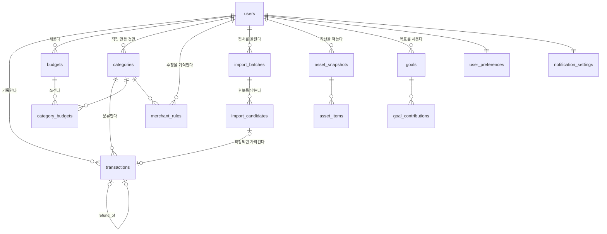

# 데이터 모델

`backend/app/models/` 를 읽고 쓴 문서다. 코드가 정본이고 이 문서는 안내다.
모델을 고쳤으면 여기도 같이 고친다. 확인 시점: 2026-09-05.

## 공통 규칙

모든 엔티티는 `app/db/base.py` 의 `Entity` 를 상속한다.

- `id`: UUID (파이썬에서 `uuid4()` 로 만든다)
- `created_at`, `updated_at`: `timestamptz`. DB 가 `now()` 로 채우고 `updated_at` 은 갱신 때 자동으로 올라간다
- `SoftDeleteMixin` 을 섞은 것은 `deleted_at` 을 갖는다. **지워도 행이 남는다. 집계는 `deleted_at IS NULL` 인 행만 센다.**

금액 타입은 두 가지다.

- `MoneyColumn = Numeric(14, 0)`: 거래·예산·목표. 원 단위 정수라 소수점이 없다
- `LargeMoneyColumn = Numeric(16, 0)`: 자산 항목. 자산은 자릿수가 더 크다

이름 끝에 `Column` 이 붙은 이유는 계산에 쓰는 값 객체 `app/domain/money.py` 의 `Money` 와
헷갈리지 않게 하기 위해서다. 둘은 완전히 다른 것이다.

부동소수점을 쓰지 않는 이유는 돈이라서다. 0.1 을 세 번 더해서 0.30000000000000004 가 나오는 자리에 예산을 두지 않는다.

enum 은 전부 파이썬 `StrEnum` 이고 DB 에는 문자열(`VARCHAR(32)`)로 들어간다.
PostgreSQL 네이티브 enum 타입을 만들지 않는다. 값 하나 추가하려고 `ALTER TYPE` 마이그레이션을 쓰지 않기 위해서다.

**enum 정의는 `app/domain` 한 곳에 있다.** `TransactionType`·`TransactionSource` 는
`domain/aggregation.py`, `CategoryKind` 는 `domain/categories.py`, `AssetGroup` 은
`domain/assets.py` 다. `models` 와 API 스키마는 그것을 가져다 쓴다.
같은 값 목록을 두 곳에 적으면 하나만 고치는 사고가 난다.

## 시간대

`occurred_at` 같은 `timestamptz` 는 **UTC 로 저장**한다.
**월 경계와 '오늘'은 `users.timezone`(기본 `Asia/Seoul`) 기준**으로 다시 계산한다.
헬퍼는 `modules/ledger.py` 의 `today_for`·`period_for`·`period_bounds` 다.
UTC 로 날짜를 뽑으면 한국에서 자정부터 아침 9시까지의 거래가 전달로 집계된다.

## ER 다이어그램



## users

로그인 화면이 없다. 익명 식별키 해시 하나로만 사람을 구분한다.

| 필드 | 타입 | 설명 |
|---|---|---|
| `anon_key_hash` | `varchar(128)` unique | `User.getAnonymousKey()` 가 준 해시. 사용자를 찾는 유일한 키 |
| `timezone` | `varchar(64)` = `Asia/Seoul` | 월 경계와 하루 가용액 계산 기준 |
| `last_seen_at` | `timestamptz?` | 며칠 쉬었는지 판단해 복구 화면을 고르는 데 쓴다 |

**이름·이메일·전화번호 컬럼이 없다.** 없어서 못 쓰는 것이 아니라 안 갖기로 한 것이다.

⚠ **탈퇴 동작은 아직 정하지 않았다.** `users` 에 `SoftDeleteMixin` 이 붙어 있고
`anon_key_hash` 가 unique 라, 삭제 표시된 사용자가 다시 들어오면 옛 행에 그대로 붙어
지운 데이터가 살아난다. 설정 화면에 '데이터 삭제' 를 만들 때 둘 중 하나로 정하고 여기에 적는다.
(a) 하드 삭제(FK CASCADE) (b) 삭제 시 `anon_key_hash` 를 덮어써 재진입이 새 행이 되게 한다.

## categories

| 필드 | 타입 | 설명 |
|---|---|---|
| `user_id` | `uuid?` | **NULL 이면 모든 사용자에게 보이는 기본 카테고리** |
| `name` | `varchar(40)` | |
| `kind` | `expense` \| `income` \| `transfer` | |
| `icon_key` | `varchar(64)` | `public/icons/sm/` 의 파일 이름(확장자 제외) |
| `sort_order` | `int` = 0 | |

`(user_id, name)` 이 유일하고 `postgresql_nulls_not_distinct=True` 를 걸었다.
이게 없으면 NULL 끼리는 서로 다른 값으로 취급돼 기본 카테고리 이름이 중복으로 생긴다.

**기본 카테고리 목록의 정본은 `app/domain/categories.py` 의 `DEFAULT_CATEGORIES` 다.**
이름·종류·아이콘 키·순서가 거기 있고, LLM 분류 힌트와 프론트 아이콘 매핑이 그걸 따라간다.
프론트 `shared/ui/icons.ts` 와 어긋나면 `tests/domain/test_categories.py` 가 깨진다.

**기본 11개는 마이그레이션 `c4a1b8f2d7e3` 이 심는다.** `user_id` 는 NULL 이고 id 는 이름으로
만든 uuid5 라 어느 환경에서 돌려도 값이 같다. 이미 있는 이름은 건드리지 않아서 두 번 돌아도
중복이 생기지 않는다. 목록은 그 파일 안에 값으로 박혀 있다. 적용이 끝난 리비전의 의미가
나중에 바뀌면 안 되기 때문이고, 도메인 목록과 어긋나면
`tests/test_default_category_seed.py` 가 잡는다(ADR-0008).

## transactions

입력 네 경로가 전부 이 표 하나로 모인다.

| 필드 | 타입 | 설명 |
|---|---|---|
| `user_id` | `uuid` | |
| `amount` | `numeric(14,0)` | **항상 양수.** 의미는 `type` 이 만든다 |
| `type` | `expense` \| `income` \| `transfer` \| `refund` | |
| `occurred_at` | `timestamptz` | 결제 시각. 기록한 시각이 아니다 |
| `merchant` | `varchar(120)?` | 화면에 보여주는 상호명 |
| `merchant_normalized` | `varchar(120)?` | 중복 판정과 자동 분류가 맞춰 보는 정규화 값 |
| `category_id` | `uuid?` | 카테고리를 지워도 거래는 남는다(`SET NULL`) |
| `source` | `keypad` \| `nl` \| `screenshot` \| `receipt` \| `asset_screenshot` \| `no_spend` | 어떤 경로로 들어왔는지 |
| `confidence` | `float` = 1.0 | 0~1. 사용자가 직접 넣은 값은 1.0 |
| `excluded_from_budget` | `bool` = false | **거래목록·리포트에는 남고 예산 계산에서만 빠진다** |
| `fingerprint` | `varchar(64)?` | 중복 후보를 찾는 sha256 해시 |
| `refund_of_transaction_id` | `uuid?` | 어떤 지출의 환불인지 |
| `import_batch_id` | `uuid?` | 줄글·캡처 분석에서 저장했으면 그 묶음. `imports.commit_batch` 가 채운다 |

제약:

- `amount > 0 OR source = 'no_spend'` — 무지출일 표시만 0 을 허용한다
- `confidence >= 0 AND confidence <= 1`

인덱스: `(user_id, occurred_at)`, `(user_id, type, occurred_at)`, `(user_id, fingerprint)`.
월별 조회, 종류별 집계, 중복 판정이 실제로 때리는 세 패턴이다.

### fingerprint

```
sha256( occurred_on(YYYY-MM-DD) | amount(정수) | normalize(merchant) | type )
```

지문은 거래를 저장·수정할 때 서버가 채운다(`transactions.service._stamp_identity`).
M4 이전에 저장한 거래에는 지문이 없어 중복 판정에 걸리지 않는다. 되메우지 않았다.

범위는 `user_id` 안이다. **정확히 일치할 때만** 중복 후보로 보고, 후보는 **기본 미선택**으로 보여준다.
`merchant` 가 비어 있으면 fingerprint 는 만들되 중복 판정에서 뺀다. 상호가 없는 두 건이 같은 금액이라는 이유로 묶이면 오탐이 너무 많다.

## budgets / category_budgets

| budgets | 타입 | 설명 |
|---|---|---|
| `user_id` | `uuid` | |
| `period_start`, `period_end` | `date` | |
| `amount` | `numeric(14,0)` | `>= 0` |
| `is_auto_carried` | `bool` = false | 직전 기간에서 자동 복사된 예산. 비차단 안내 배너의 근거 |

`(user_id, period_start)` 가 유일하다. **소프트 삭제한 행도 이 자리를 지킨다.**
사용자가 자동 복사분을 지웠는데 다음 조회에서 또 복사되면 안 되기 때문이다. 지운 행 자체가 tombstone 역할을 한다.

다만 사용자가 그 기간 예산을 **직접 다시 정하면**(`PUT /budgets`) 그 행을 되살린다.
tombstone 은 자동 복사를 막으려던 것이지 직접 정하는 것까지 막으려던 것이 아니다.
되살릴 때 `is_auto_carried` 를 false 로 내린다(ADR-0008).

`category_budgets` 는 `(budget_id, category_id)` 가 유일하고 `amount >= 0` 이다. 예산을 지우면 같이 지워진다.

### 자동 이어쓰기

첫 조회 시점에 lazy 하게 판단한다. 쓰기 요청도 같은 판단을 먼저 지나서, 그 달을 아직
조회하지 않았어도 조회와 같은 상태를 보고 시작한다.

```
그 기간이 오늘을 품지 않음                  → 아무것도 안 함 (넘겨보는 것만으로 유령 예산 금지)
그 기간이 월 전체가 아님                    → 아무것도 안 함 (직전 기간을 정의할 수 없다)
현재 기간에 Budget 있음                    → 아무것도 안 함
pref.budget_auto_carryover = false         → 복사 안 함
현재 기간에 소프트 삭제된 Budget 있음        → 복사 안 함 (사용자가 지운 자리, tombstone)
직전 기간(바로 앞 1개)에 Budget 없음        → 자동 생성 안 함
그 외                                      → Budget + CategoryBudget 복사, is_auto_carried = true
```

## user_preferences / notification_settings

첫 기록 전에 아무것도 묻지 않으므로 전부 기본값이 있다. 사용자당 한 행이다.

| user_preferences | 기본값 | 설명 |
|---|---|---|
| `budget_auto_carryover` | true | 새 기간 예산 자동 복사 여부 |
| `home_hero` | `remaining_budget` | `remaining_budget` \| `income_expense` \| `income_and_budget` |
| `last_record_method` | NULL | 기록 시트를 마지막에 쓴 방식으로 열어 준다 |
| `report_include_income` | false | 리포트 기본은 소비만 |
| `happy_spend_category_id` | NULL | 사용자가 지키기로 한 소비. 감축 1순위로 추천하지 않는다 |

| notification_settings | 기본값 | 설명 |
|---|---|---|
| `is_enabled` | **false** | 옵트인. 진입 즉시 동의 시트를 띄우지 않는다 |
| `remind_at` | NULL | |
| `frequency` | `weekly_twice` | `weekly_twice` \| `daily` |
| `timezone` | `Asia/Seoul` | |

## merchant_rules

줄글로 저장할 때 상호와 분류를 기억한다. 전역 사전보다 이 규칙이 우선한다.
소프트 삭제라 지웠다가 같은 상호를 다시 저장하면 그 행을 되살린다.

| 필드 | 설명 |
|---|---|
| `user_id` + `merchant_normalized` | 유일. 한 상호에 규칙 하나 |
| `merchant` | 화면에 그대로 보여 줄 표기. 정규화하면 띄어쓰기·대소문자가 사라져 읽기 나쁘다 |
| `category_id` | 이 상호는 이 카테고리 |
| `applied_count` | 실제로 몇 번 맞았는지. 자주 쓰는 카테고리를 앞에 놓을 때 쓴다 |

## import_batches / import_candidates

캡처·영수증·줄글을 한 번 올려서 여러 건을 검토하는 단위다.

| import_batches | 설명 |
|---|---|
| `source` | `transactions.source` 와 같은 enum. 지금 실제로 들어오는 값은 `nl` 과 `screenshot` 둘이다 |
| `status` | `pending` → `analyzing` → `ready` → `committed`, 실패는 `failed` |
| `detected_count` / `committed_count` | "N건 인식, M건 저장" 문구의 근거 |
| `error_code` | 재시도 화면에서 무엇이 실패했는지 구분하는 코드. **원문은 담지 않는다** |
| `completed_at` | |

| import_candidates | 설명 |
|---|---|
| `occurred_at`, `amount`, `type`, `merchant`, `merchant_normalized`, `category_id`, `confidence`, `fingerprint` | 거래와 같은 모양 |
| `is_duplicate` | 기존 거래와 정확히 일치. 화면에서 기본 미선택 |
| `is_selected` | 사용자가 저장하기로 고른 것 |
| `sort_order` | 화면 순서 |
| `transaction_id` | 저장을 마치면 만들어진 거래를 가리킨다 |

제약은 `amount > 0`, `confidence` 0~1. 배치를 지우면 후보도 지워진다.

**`status` 중 지금 쓰는 것은 `ready` 와 `committed` 둘뿐이다.** 분석이 요청 안에서 동기로 끝나
묶음이 만들어질 때부터 `ready` 다. `pending`·`analyzing`·`failed` 는 비동기 분석을 여는 날
되살린다. 지금 실패는 묶음을 만들지 않고 그대로 4xx·503 으로 나간다.

**원본 이미지, OCR 텍스트, LLM 응답 원문은 이 표에 없다.** 구조화된 후보만 남긴다.
캡처는 파일로도 임시 디렉터리에도 쓰지 않는다. **요청 처리가 끝나 파이썬 객체가 회수되는 것이
삭제다**(ADR-0010). 그래서 오인식을 나중에 다시 볼 원본이 없고, 거래의 `import_batch_id` 와
`parse_usages` 한 줄이 남는 실마리의 전부다.

## parse_usages

줄글·캡처 분석을 몇 번 불렀는지 센다. 비용을 재고 나서 상한을 정하려고 만든 표다.

| 필드 | 설명 |
|---|---|
| `source` | `transactions.source` 와 같은 enum |
| `provider` / `is_stub` | 스텁으로 잰 수치를 실제 모델 성능으로 오해하지 않게 함께 남긴다 |
| `input_length` | 크기만. 줄글은 글자 수, **캡처는 디코드한 이미지 바이트 수**다. 무엇을 적었는지·무엇이 찍혔는지는 남기지 않는다 |
| `redacted_count` | 보내기 전에 가린 숫자 뭉치 개수. 가리는 규칙이 실제로 도는지 확인한다 |
| `candidate_count` | 뽑은 후보 건수 |

인덱스는 `(user_id, created_at)`. 하루치를 세는 질의가 이걸 때린다.
상한은 `NL_PARSE_DAILY_LIMIT`(기본 300)이고, 넘으면 429 `USAGE_LIMIT` 이다.
**줄글과 캡처가 이 상한을 함께 쓴다.** 429 문구만 갈리고 세는 것은 하나다. 나중에 갈라야 하면
`source` 로 조회 조건을 좁히면 되도록, 지금부터 `screenshot` 을 남긴다.

**`redacted_count` 는 캡처에서 늘 0 이다.** `app/domain/redaction.py` 의 `redact()` 가 문자열
전용이라 이미지 안의 카드번호·계좌·잔액을 가릴 수단이 없다. 0 은 "가릴 것이 없었다" 가 아니라
**"가리지 못했다" 는 사실이 표에 남은 것**이다(ADR-0010).

**이 표만 봐서는 무엇을 적었는지 알 수 없다.** 그것이 이 표의 설계 조건이다.

## asset_snapshots / asset_items (P1)

정확한 계좌관리가 아니라 시점별 대략 스냅샷이다. 모델만 있고 화면은 P1 에서 만든다.

| asset_snapshots | 설명 |
|---|---|
| `effective_on` | 사용자가 확인한 기준일. 순자산 추이를 이 날짜로 정렬한다 |
| `source` | `manual` \| `screenshot` |

| asset_items | 설명 |
|---|---|
| `group` | `cash` \| `investment` \| `deposit` \| `debt` (컬럼명은 `asset_group`. `group` 이 SQL 예약어다) |
| `label` | 금융사·항목 표시명. **계좌·카드번호는 저장하지 않는다** |
| `amount` | `numeric(16,0)`, `>= 0`. **부채도 양수로 저장한다.** 빼는 것은 `group` 이 결정한다 |
| `confidence` | 캡처 인식값의 신뢰도. 직접 입력이면 1.0 |

## goals / goal_contributions (P1)

| goals | 설명 |
|---|---|
| `title`, `target_amount` (`> 0`), `target_date?`, `initial_amount` (`>= 0`) | |
| `status` | `active` \| `achieved` \| `archived` |

`status = 'active' AND deleted_at IS NULL` 인 행에 부분 유니크 인덱스가 걸려 있다.
**진행 중인 목표는 사용자당 하나뿐이다.** 다중 목표는 P2 라서 DB 가 먼저 막는다.

`goal_contributions` 는 `amount > 0`, `source` 는 `manual` \| `asset_snapshot` 이다.

## 세 금액 개념이 왜 따로인가

`balance` 하나로 뭉치면 안 되는 값 셋이다. 계산식도, 답하는 질문도, 나오는 화면도 다르다.

| 개념 | UI 문구 | 계산 | 답하는 질문 |
|---|---|---|---|
| 남은 예산 | `남은 예산` | `budget.amount − budgetedSpend` | 이번 달 더 써도 되나 |
| 이번 달 차액 | `이번 달 차액` | `monthIncome − monthExpense` | 이번 달 벌이보다 많이 썼나 |
| 순자산 | `순자산` | `Σ AssetItem(group ≠ debt) − Σ AssetItem(group = debt)` | 지금 내 재산이 얼마인가 |

예산을 안 세운 사람에게 남은 예산은 없지만 차액은 있다.
지출이 수입보다 적어도 예산은 초과할 수 있다.
자산이 늘어도 이번 달 지출은 초과일 수 있다.
셋을 한 숫자로 합치면 어느 질문에도 제대로 답하지 못한다. `순흐름` 같은 합성 용어도 UI 에 쓰지 않는다.

## 집계 규칙

```
budgetedSpend   = Σ expense(excluded=false) − Σ refund(excluded=false)   [기간 내, 삭제 제외]
remainingBudget = budget.amount − budgetedSpend
monthExpense    = Σ expense − Σ refund      (excluded 무관)
monthIncome     = Σ income
monthlyDelta    = monthIncome − monthExpense
netWorth        = Σ AssetItem(group≠debt) − Σ AssetItem(group=debt)
```

| 종류 | 이번달 지출 | 이번달 수입 | 차액 | 남은 예산 | 카테고리 지출 |
|---|---|---|---|---|---|
| expense | +amount | – | −amount | −amount | +amount |
| income | – | +amount | +amount | 영향 없음 | 영향 없음 |
| transfer | 제외 | 제외 | 제외 | 제외 | 제외 |
| refund | −amount | 제외 | +amount | +amount | −amount |

근거는 `ADR/0005-transfer-refund-aggregation.md`. 계산은 `backend/app/domain` 한 곳에서만 한다.

## 저장 금지 항목

DB 는 물론이고 **analytics 와 error log 에도 남기지 않는다.**

| 남기지 않는 것 | 왜 |
|---|---|
| OCR 로 읽은 원문 텍스트 | 결제 알림에는 카드번호 뒷자리, 잔액, 다른 사람 이름이 섞여 들어온다 |
| LLM 요청·응답 원문 | 위와 같다. 프롬프트에 원문이 들어가고 로그에 남으면 결국 같은 유출이다 |
| 원본 캡처·영수증 이미지 | 구조화된 후보만 남기면 충분하다. 파일로 쓰지 않으므로 지울 단계도 없다 |
| 계좌번호, 카드번호(뒷자리 포함) | 있으면 언젠가 새어 나간다. 처음부터 안 갖는다 |
| 이름·이메일·전화번호 | 익명 식별키로 충분하다 |

에러를 추적해야 하면 `import_batches.error_code` 처럼 **원문이 아닌 코드**를 남긴다.
로그에 사용자 입력을 통째로 찍는 코드를 넣지 않는다. `app/core/logging.py` 의 구조화 로거를 쓰고 필드를 골라 넣는다.

⚠ **저장하지 않는 것과 보내지 않는 것은 다르다.** 위 표는 우리가 남기지 않는 것의 목록이지,
provider 에 가지 않는 것의 목록이 아니다. 줄글은 보내기 전에 `redact()` 로 가리지만
**캡처 이미지는 가릴 수단이 없어 찍힌 그대로 나간다.** 근거와 대응은 ADR-0010 과
`SECRETS.md` §4 에 있다.
