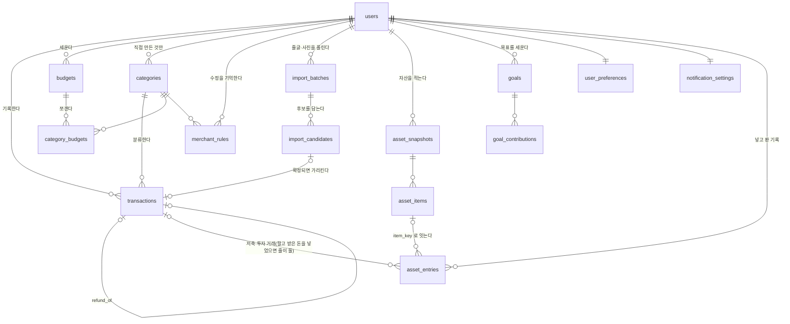
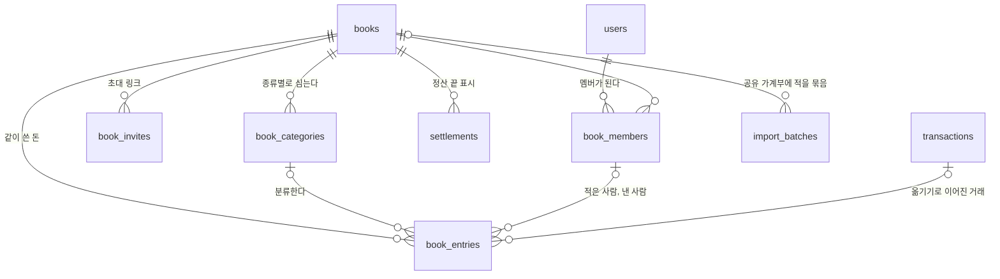

# 데이터 모델

`backend/app/models/` 를 읽고 쓴 문서다. 코드가 정본이고 이 문서는 안내다.
모델을 고쳤으면 여기도 같이 고친다. 확인 시점: 2026-09-28.

## 공통 규칙

모든 엔티티는 `app/db/base.py` 의 `Entity` 를 상속한다.

- `id`: UUID (파이썬에서 `uuid4()` 로 만든다)
- `created_at`, `updated_at`: `timestamptz`. DB 가 `now()` 로 채우고 `updated_at` 은 갱신 때 자동으로 올라간다
- `SoftDeleteMixin` 을 섞은 것은 `deleted_at` 을 갖는다. **지워도 행이 남는다. 집계는 `deleted_at IS NULL` 인 행만 센다.**

금액 타입은 두 가지다.

- `MoneyColumn = Numeric(14, 0)`: 거래·예산·목표. 원 단위 정수라 소수점이 없다
- `LargeMoneyColumn = Numeric(16, 0)`: 자산 항목. 자산은 자릿수가 더 크다

이름 끝에 `Column` 이 붙은 이유는 계산에 쓰는 값 객체 `app/domain/money.py` 의 `Money` 와
헷갈리지 않게 하기 위해서다. 둘은 완전히 다른 것이다.

부동소수점을 쓰지 않는 이유는 돈이라서다. 0.1 을 세 번 더해서 0.30000000000000004 가 나오는 자리에 예산을 두지 않는다.

enum 은 전부 파이썬 `StrEnum` 이고 DB 에는 문자열(`VARCHAR(32)`)로 들어간다.
PostgreSQL 네이티브 enum 타입을 만들지 않는다. 값 하나 추가하려고 `ALTER TYPE` 마이그레이션을 쓰지 않기 위해서다.

**enum 정의는 `app/domain` 한 곳에 있다.** `TransactionType`·`TransactionSource` 는
`domain/aggregation.py`, `CategoryKind` 는 `domain/categories.py`, `AssetGroup` 은
`domain/assets.py` 다. `models` 와 API 스키마는 그것을 가져다 쓴다.
같은 값 목록을 두 곳에 적으면 하나만 고치는 사고가 난다.

## 시간대

`occurred_at` 같은 `timestamptz` 는 **UTC 로 저장**한다.
**월 경계와 '오늘'은 `users.timezone`(기본 `Asia/Seoul`) 기준**으로 다시 계산한다.
헬퍼는 `modules/ledger.py` 의 `today_for`·`period_for`·`period_bounds` 다.
예산·리포트·결산의 한 달은 `users.month_start_day` 에 시작한다(ADR-0046). 달력 화면은 달력 월 그대로다.
공유 가계부의 한 달은 가계부마다 `books.month_start_day` 에 시작한다(ADR-0050). 멤버 개인 시작일과 따로다.
UTC 로 날짜를 뽑으면 한국에서 자정부터 아침 9시까지의 거래가 전달로 집계된다.

## ER 다이어그램


```mermaid
erDiagram
  users ||--o{ transactions : "기록한다"
  users ||--o{ budgets : "세운다"
  users ||--o{ categories : "직접 만든 것만"
  users ||--o{ merchant_rules : "수정을 기억한다"
  users ||--o{ import_batches : "줄글·사진을 올린다"
  users ||--o{ asset_snapshots : "자산을 적는다"
  users ||--o{ goals : "목표를 세운다"
  users ||--|| user_preferences : ""
  users ||--|| notification_settings : ""

  categories ||--o{ transactions : "분류한다"
  categories ||--o{ category_budgets : ""
  categories ||--o{ merchant_rules : ""

  budgets ||--o{ category_budgets : "쪼갠다"

  import_batches ||--o{ import_candidates : "후보를 담는다"
  import_candidates |o--o| transactions : "확정되면 가리킨다"
  transactions |o--o| transactions : "refund_of"

  asset_snapshots ||--o{ asset_items : ""
  users ||--o{ asset_entries : "넣고 판 기록"
  asset_items |o--o{ asset_entries : "item_key 로 잇는다"
  transactions |o--o{ asset_entries : "저축·투자 거래(팔고 받은 돈을 넣었으면 줄이 둘)"
  goals ||--o{ goal_contributions : ""
```

공유 가계부는 개인 표와 따로 선다(ADR-0042). 사람을 가리키는 칸은 사용자 줄이 아니라 멤버 줄을 본다.


```mermaid
erDiagram
  users ||--o{ book_members : "멤버가 된다"
  books ||--o{ book_members : ""
  books ||--o{ book_invites : "초대 링크"
  books ||--o{ book_categories : "종류별로 심는다"
  books ||--o{ book_entries : "같이 쓴 돈"
  books ||--o{ settlements : "정산 끝 표시"
  book_categories |o--o{ book_entries : "분류한다"
  book_members |o--o{ book_entries : "적은 사람, 낸 사람"
  transactions |o--o{ book_entries : "옮기기로 이어진 거래"
  books |o--o{ import_batches : "공유 가계부에 적을 묶음"
```

## users

로그인 화면이 없다. 익명 식별키 해시 하나로만 사람을 구분한다.

| 필드 | 타입 | 설명 |
|---|---|---|
| `anon_key_hash` | `varchar(128)` unique | `User.getAnonymousKey()` 가 준 해시. 사용자를 찾는 유일한 키 |
| `timezone` | `varchar(64)` = `Asia/Seoul` | 월 경계와 하루 가용액 계산 기준 |
| `month_start_day` | `smallint` = 1, 1 ~ 28 | 예산·리포트·결산의 한 달이 시작하는 날. 1 이면 달력 월. 기간 이름 규칙은 ADR-0046 |
| `last_seen_at` | `timestamptz?` | 며칠 쉬었는지 판단해 복구 화면을 고르는 데 쓴다 |

**이름·이메일·전화번호 컬럼이 없다.** 없어서 못 쓰는 것이 아니라 안 갖기로 한 것이다.

⚠ **탈퇴 동작은 아직 정하지 않았다.** `users` 에 `SoftDeleteMixin` 이 붙어 있고
`anon_key_hash` 가 unique 라, 삭제 표시된 사용자가 다시 들어오면 옛 행에 그대로 붙어
지운 데이터가 살아난다. 설정 화면에 '데이터 삭제' 를 만들 때 둘 중 하나로 정하고 여기에 적는다.
(a) 하드 삭제(FK CASCADE) (b) 삭제 시 `anon_key_hash` 를 덮어써 재진입이 새 행이 되게 한다.

## categories

| 필드 | 타입 | 설명 |
|---|---|---|
| `user_id` | `uuid?` | **NULL 이면 모든 사용자에게 보이는 기본 카테고리** |
| `name` | `varchar(40)` | |
| `kind` | `expense` \| `income` \| `transfer` | |
| `icon_key` | `varchar(64)` | `public/icons/sm/` 의 파일 이름(확장자 제외) |
| `sort_order` | `int` = 0 | |

`(user_id, name)` 이 유일하고 `postgresql_nulls_not_distinct=True` 를 걸었다.
이게 없으면 NULL 끼리는 서로 다른 값으로 취급돼 기본 카테고리 이름이 중복으로 생긴다.

**기본 카테고리 목록의 정본은 `app/domain/categories.py` 의 `DEFAULT_CATEGORIES` 다.**
이름·종류·아이콘 키·순서가 거기 있고, LLM 분류 힌트와 프론트 아이콘 매핑이 그걸 따라간다.
프론트 `shared/ui/icons.ts` 와 어긋나면 `tests/domain/test_categories.py` 가 깨진다.

**기본 14개는 마이그레이션 셋이 나눠 심는다.** `c4a1b8f2d7e3` 이 11개를 먼저 넣고,
그 위에 `a3f1c07b52d4` 가 수입 쪽을 셋으로 갈랐고, `d4a2e8c31b70` 이 `부업` 을 더했다. 옛 `수입` 행을 지우지 않고 `기타 수입` 으로
이름만 옮긴 뒤 `월급`·`용돈` 을 새로 넣는다. 지우고 새로 넣으면 그 분류로 적어 둔 거래의
`category_id` 가 통째로 빠지기 때문이다(FK 가 `SET NULL`). 그래서 **`기타 수입` 의 id 는
`uuid5('수입')` 인 채로 남는다.** 이름이 아니라 id 로 이어지는 값이라 그대로 두는 것이 맞다.
`부업` 을 넣을 때도 같은 이유로 `기타 수입` 의 `sort_order` 만 뒤로 밀었다(102 → 104).
기타는 목록 끝에 있어야 어디까지가 실제 갈래인지 읽힌다.

`user_id` 는 NULL 이고 id 는 이름으로 만든 uuid5 라 어느 환경에서 돌려도 값이 같다.
이미 있는 이름은 건드리지 않아서 두 번 돌아도 중복이 생기지 않는다. 목록은 그 파일 안에
값으로 박혀 있다. 적용이 끝난 리비전의 의미가 나중에 바뀌면 안 되기 때문이고,
도메인 목록과 어긋나면 `tests/test_default_category_seed.py` 가 잡는다(ADR-0008).

## transactions

입력 네 경로가 전부 이 표 하나로 모인다.

| 필드 | 타입 | 설명 |
|---|---|---|
| `user_id` | `uuid` | |
| `amount` | `numeric(14,0)` | **항상 양수.** 의미는 `type` 이 만든다 |
| `type` | `expense` \| `income` \| `transfer` \| `refund` | |
| `occurred_at` | `timestamptz` | 결제 시각. 기록한 시각이 아니다 |
| `merchant` | `varchar(120)?` | 화면에 보여주는 상호명 |
| `merchant_normalized` | `varchar(120)?` | 중복 판정과 자동 분류가 맞춰 보는 정규화 값 |
| `category_id` | `uuid?` | 분류를 지우면 이 칸만 비고 거래는 남는다. FK 가 `SET NULL` 이지만 실제로는 소프트 삭제라 행이 안 지워지고, 서비스가 분류를 떼어 낸다 |
| `source` | `keypad` \| `nl` \| `screenshot` \| `receipt` \| `asset_screenshot` \| `no_spend` | 어떤 경로로 들어왔는지 |
| `asset_item_key` · `asset_side` · `asset_quantity` | null 허용 | 저축·투자. `type=transfer` 에 「어디에」 를 붙인 것이다(ADR-0045). 집계는 이 칸을 안 본다 |
| `asset_remaining` · `asset_cost_basis` | null 허용 | 금액 종목을 팔 때만. 팔고 남은 금액(0 이면 전부)과, 넣은 돈을 모를 때 적은 넣은 돈 전체(ADR-0047). 장부 sell 줄의 `remaining` · `cost_basis` 로 넘어간다 |
| `asset_proceeds_key` | `uuid?` | 팔았어요로 받은 돈을 넣은 통장(ADR-0049). 예적금·현금 항목의 `item_key` 다. 팔기 기록에만 있고, 넣었어요로 바꾸거나 어디에를 비우면 서버가 비운다. 차 있으면 그 통장 장부에 `is_proceeds` 줄이 하나 생긴다 |
| `confidence` | `float` = 1.0 | 0~1. 사용자가 직접 넣은 값은 1.0 |
| `excluded_from_budget` | `bool` = false | **거래목록·리포트에는 남고 예산 계산에서만 빠진다** |
| `payment_method` | `credit` \| `debit` \| `cash` \| `null` | 신용카드·체크카드·현금. **지출과 환불에만 붙고** 수입·이체로 고치면 서비스가 비운다. `null` 이 「안 고름」이라 '모름' 값을 따로 두지 않는다 |
| `memo` | `varchar(200)?` | 상호와 **다른 칸**이다. 「어디서」 가 아니라 「무엇을·왜」. 저장한 뒤에 묻고, 목록 줄은 분류 이름 대신 이 한마디를 보여 준다 |
| `tag_id` | `uuid?` | **한 기록에 하나.** 여럿 달면 태그별 합계가 총액을 넘어 리포트의 「비율」 이 거짓이 된다. FK 가 `SET NULL` 이라 태그를 지워도 거래는 남는다 |
| `fingerprint` | `varchar(64)?` | 중복 후보를 찾는 sha256 해시 |
| `refund_of_transaction_id` | `uuid?` | 어떤 지출의 환불인지 |
| `import_batch_id` | `uuid?` | 줄글·캡처·영수증 분석에서 저장했으면 그 묶음. `imports.commit_batch` 가 채운다 |

제약:

- `amount > 0 OR source = 'no_spend'` — 무지출일 표시만 0 을 허용한다
- `confidence >= 0 AND confidence <= 1`

무지출 표시는 하루 하나이고, **그 날 지출과 함께 남지 않는다.** DB 제약이 아니라 서비스
계층이 지킨다(지출을 저장하면 그 날 표시를 소프트 삭제하고, 쓴 날에는 표시를 만들지 못하게
막는다). 표는 그대로 두 줄을 담을 수 있으니 이 규칙은 코드에만 있다.

인덱스: `(user_id, occurred_at)`, `(user_id, type, occurred_at)`, `(user_id, fingerprint)`.
월별 조회, 종류별 집계, 중복 판정이 실제로 때리는 세 패턴이다.

### fingerprint

```
sha256( occurred_on(YYYY-MM-DD) | amount(정수) | normalize(merchant) | type )
```

지문은 거래를 저장·수정할 때 서버가 채운다(`transactions.service._stamp_identity`).
M4 이전에 저장한 거래에는 지문이 없어 중복 판정에 걸리지 않는다. 되메우지 않았다.

범위는 `user_id` 안이다. **정확히 일치할 때만** 중복 후보로 보고, 후보는 **기본 미선택**으로 보여준다.
`merchant` 가 비어 있으면 fingerprint 는 만들되 중복 판정에서 뺀다. 상호가 없는 두 건이 같은 금액이라는 이유로 묶이면 오탐이 너무 많다.

## budgets / category_budgets

| budgets | 타입 | 설명 |
|---|---|---|
| `user_id` | `uuid` | |
| `period_start`, `period_end` | `date` | 그 사용자의 한 달 기간. 시작일이 25 면 `2026-09-25 ~ 2026-10-24`(「10월」) |
| `amount` | `numeric(14,0)` | `>= 0` |
| `is_auto_carried` | `bool` = false | 직전 기간에서 자동 복사된 예산. 비차단 안내 배너의 근거 |

`(user_id, period_start)` 가 유일하다. **소프트 삭제한 행도 이 자리를 지킨다.**
사용자가 자동 복사분을 지웠는데 다음 조회에서 또 복사되면 안 되기 때문이다. 지운 행 자체가 tombstone 역할을 한다.

다만 사용자가 그 기간 예산을 **직접 다시 정하면**(`PUT /budgets`) 그 행을 되살린다.
tombstone 은 자동 복사를 막으려던 것이지 직접 정하는 것까지 막으려던 것이 아니다.
되살릴 때 `is_auto_carried` 를 false 로 내린다(ADR-0008).

`category_budgets` 는 `(budget_id, category_id)` 가 유일하고 `amount >= 0` 이다. 예산을 지우면 같이 지워진다.

**한 달 시작일을 바꾸면** 그 사용자의 예산 줄(지운 줄과 지난 달 포함)을 각 줄의 이름 달 그대로
새 시작일의 기간으로 옮긴다. 「10월」 예산은 시작일 25 에서 5 로 바꾸면 `10-05 ~ 11-04` 로 간다.
카테고리 예산은 `budget_id` 로 딸려 있어 함께 따라온다. 같은 요청, 같은 커밋 안에서 끝난다.
이름 달이 같은 줄이 둘이면 살아 있는 줄, 사람이 정한 줄(`is_auto_carried = false`), 나중에 고친 줄 순으로
하나만 남기고, 지우는 줄의 카테고리 예산 가운데 남는 줄에 없는 분류는 남는 줄로 옮긴다.
계정을 합칠 때도 source 의 예산 줄을 이름 달로 읽어 target 의 시작일 기간으로 옮긴다. 이름 달이 겹치면 target 것을 남긴다.

### 자동 이어쓰기

첫 조회 시점에 lazy 하게 판단한다. 쓰기 요청도 같은 판단을 먼저 지나서, 그 달을 아직
조회하지 않았어도 조회와 같은 상태를 보고 시작한다.

```
그 기간이 오늘을 품지 않음                  → 아무것도 안 함 (넘겨보는 것만으로 유령 예산 금지)
그 기간이 사용자의 한 달 기간이 아님          → 아무것도 안 함 (달력 월을 넘겨도 줄을 만들지 않는다)
현재 기간에 Budget 있음                    → 아무것도 안 함
pref.budget_auto_carryover = false         → 복사 안 함
현재 기간에 소프트 삭제된 Budget 있음        → 복사 안 함 (사용자가 지운 자리, tombstone)
직전 기간(바로 앞 1개)에 Budget 없음        → 자동 생성 안 함
그 외                                      → Budget + CategoryBudget 복사, is_auto_carried = true
```

## user_preferences / notification_settings

첫 기록 전에 아무것도 묻지 않으므로 전부 기본값이 있다. 사용자당 한 행이다.

| user_preferences | 기본값 | 설명 |
|---|---|---|
| `budget_auto_carryover` | true | 새 기간 예산 자동 복사 여부 |
| `home_hero` | `remaining_budget` | `remaining_budget` \| `income_expense` \| `income_and_budget` |
| `last_record_method` | NULL | 기록 시트를 마지막에 쓴 방식으로 열어 준다. 거래를 저장할 때 서버가 그 거래의 `source` 로 남긴다. 화면은 읽기만 한다 |
| `report_include_income` | false | 리포트 기본은 소비만 |
| `happy_spend_category_id` | NULL | 사용자가 지키기로 한 소비. 감축 1순위로 추천하지 않는다 |
| `quick_hidden_category_ids` | `[]` | 기록 화면 칩에서 **뺀** 분류의 id. 빈 목록이 곧 「전부 보인다」 |
| `quick_category_order` | `[]` | 칩이 설 순서. 여기 적힌 것이 앞이고 나머지는 `sort_order` 순으로 뒤에 붙는다. 빈 목록이 곧 「서버가 준 순서 그대로」 |

**칩에 관한 값 둘이 카테고리 행이 아니라 여기 있다.** 기본 분류는 모두가 같은 행을 보기
때문이다. 거기에 적으면 한 사람이 끄거나 옮긴 것이 전부에게 번진다. 지운 분류의 id 가
남을 수 있는데, 둘 다 있는 것만 골라 쓰므로 그대로 둔다.

| notification_settings | 기본값 | 설명 |
|---|---|---|
| `is_enabled` | **false** | 옵트인. 진입 즉시 동의 시트를 띄우지 않는다 |
| `remind_at` | NULL | `HH:MM`. 켜면서 안 주면 서버가 **20:00** 을 넣는다(2026-09-18 에 21:30 에서 옮김) |
| `frequency` | `weekly_twice` | `weekly_twice` \| `daily`. **발송기는 읽지 않는다.** 하루 한 통 고정(ADR-0013·0022). 화면에 고르는 자리는 없고 켤 때 `daily` 로 온다 |
| `timezone` | `Asia/Seoul` | **읽지 않는다.** 아래 참고 |
| `last_reminded_on` | NULL | 마지막으로 보낸 현지 날짜. 같은 날 두 번 보내지 않는 기준이다 |

**알림 시각의 시간대 정본은 `users.timezone` 이다.** `notification_settings.timezone` 은 초기
스키마에 있지만 아무도 읽지 않는다. 두 곳을 보면 달 경계와 알림 시각이 서로 다른 시간대로
갈려서, 한 사람의 '오늘' 이 화면과 알림에서 달라진다. 판정과 발송 구조는 ADR-0013·0022 에 있다.
`last_reminded_on` 은 **두 갈래가 함께 쓰는 하루 상한**이다. 반복 지출 예고가 아침에 울린
날에는 저녁 기록 알림이 안 간다.

## merchant_rules

검토 목록을 저장할 때 상호와 분류를 기억한다. **줄글·캡처·영수증 셋 다 쌓는다.**
저장하는 코드가 한 곳(`imports/service.commit_batch`)이라 입구로 갈리지 않는다.
전역 사전보다 이 규칙이 우선한다.
소프트 삭제라 지웠다가 같은 상호를 다시 저장하면 그 행을 되살린다.

**사용자가 직접 걸 수도 있다.** 자주 가는 가게를 미리 적어 두면 첫 캡처부터 그 분류로 들어온다.
어느 쪽으로 생긴 규칙인지는 `source` 가 들고 있다.

쌓이는 것은 **지출과 수입**이다. 이체는 분류가 하나뿐이고 환불은 대상의 분류를 따라간다.
붙일 때는 분류의 `kind` 가 후보의 `type` 과 맞아야 한다. 한 상호에 규칙이 하나라서 같은 상호를
수입으로도 적으면 규칙이 덮이는데, 덮인 종류의 후보에는 붙지 않고 모델이 고른 이름으로 돌아간다.

| 필드 | 설명 |
|---|---|
| `user_id` + `merchant_normalized` | 유일. 한 상호에 규칙 하나 |
| `merchant` | 화면에 그대로 보여 줄 표기. 정규화하면 띄어쓰기·대소문자가 사라져 읽기 나쁘다 |
| `category_id` | 이 상호는 이 카테고리 |
| `applied_count` | 실제로 몇 번 맞았는지. 자주 쓰는 카테고리를 앞에 놓을 때 쓴다. 손으로 건 규칙은 0 에서 시작하고 걸었다고 올리지 않는다 |
| `source` | `learned`(앱이 기억) · `manual`(사람이 적음). 목록을 가르는 값이고, 손으로 건 것이 위에 선다 |

## import_batches / import_candidates

캡처·영수증·줄글을 한 번 올려서 여러 건을 검토하는 단위다.

| import_batches | 설명 |
|---|---|
| `source` | `transactions.source` 와 같은 enum. 지금 실제로 들어오는 값은 `nl` · `screenshot` · `receipt` 셋이다 |
| `status` | `pending` → `analyzing` → `ready` → `committed`, 실패는 `failed` |
| `detected_count` / `committed_count` | "N건 인식, M건 저장" 문구의 근거 |
| `error_code` | 재시도 화면에서 무엇이 실패했는지 구분하는 코드. **원문은 담지 않는다** |
| `completed_at` | |
| `book_id` | 공유 가계부에 적으려고 읽은 묶음이면 그 가계부(`CASCADE`). 비면 내 가계부 |

| import_candidates | 설명 |
|---|---|
| `occurred_at`, `amount`, `type`, `merchant`, `merchant_normalized`, `category_id`, `payment_method`, `confidence`, `fingerprint` | 거래와 같은 모양 |
| `is_duplicate` | 기존 거래와 정확히 일치. 화면에서 기본 미선택 |
| `is_selected` | 사용자가 저장하기로 고른 것 |
| `sort_order` | 화면 순서 |
| `transaction_id` | 저장을 마치면 만들어진 거래를 가리킨다 |
| `book_category_id` | 공유 묶음에서 고른 그 가계부의 분류(`SET NULL`). `category_id` 는 개인 분류 외래키라 여기 따로 둔다 |
| `book_entry_id` | 공유 묶음을 저장하면 만들어진 공유 기록(`SET NULL`) |
| `asset_item_key` · `asset_side` · `asset_quantity` | 저축·투자 줄. 저장하면 거래의 같은 이름 칸으로 넘어간다. `with_assets` 로 읽은 묶음에서만 찬다 |
| `asset_name` | 모델이 읽어 온 항목 이름(80자, 계좌번호 모양은 가린 뒤). 항목에 못 맞춰도 남는다 |

제약은 `amount > 0`, `confidence` 0~1. 배치를 지우면 후보도 지워진다.

**`status` 중 지금 쓰는 것은 `ready` 와 `committed` 둘뿐이다.** 분석이 요청 안에서 동기로 끝나
묶음이 만들어질 때부터 `ready` 다. `pending` 은 컬럼 기본값으로만 남고, `analyzing`·`failed` 는
비동기 분석을 여는 날 되살린다. 지금 실패는 묶음을 만들지 않고 그대로 4xx·503 으로 나간다.

**원본 이미지, OCR 텍스트, LLM 응답 원문은 이 표에 없다.** 구조화된 후보만 남긴다.
사진(캡처·영수증)은 파일로도 임시 디렉터리에도 쓰지 않는다. **요청 처리가 끝나 파이썬 객체가
회수되는 것이 삭제다**(ADR-0010). 그래서 오인식을 나중에 다시 볼 원본이 없고, 거래의 `import_batch_id` 와
`parse_usages` 한 줄이 남는 실마리의 전부다.

## parse_usages

줄글·캡처·영수증 분석을 몇 번 불렀는지 센다. 비용을 재고 나서 상한을 정하려고 만든 표다.

| 필드 | 설명 |
|---|---|
| `source` | `transactions.source` 와 같은 enum |
| `provider` / `is_stub` | 스텁으로 잰 수치를 실제 모델 성능으로 오해하지 않게 함께 남긴다 |
| `input_length` | 크기만. 줄글은 글자 수, **사진(캡처·영수증)은 디코드한 이미지 바이트 수**다. 무엇을 적었는지·무엇이 찍혔는지는 남기지 않는다 |
| `redacted_count` | 보내기 전에 가린 숫자 뭉치 개수. 가리는 규칙이 실제로 도는지 확인한다 |
| `candidate_count` | 뽑은 후보 건수 |

인덱스는 `(user_id, created_at)`. 하루치를 세는 질의가 이걸 때린다.
상한은 `NL_PARSE_DAILY_LIMIT`(기본 300)이고, 넘으면 429 `USAGE_LIMIT` 이다.
**줄글·캡처·영수증이 이 상한을 함께 쓴다.** 429 문구만 갈리고 세는 것은 하나다. 나중에 갈라야
하면 `source` 로 조회 조건을 좁히면 되도록, 지금부터 `screenshot`·`receipt` 를 갈라 남긴다.

**`redacted_count` 는 사진(캡처·영수증)에서 늘 0 이다.** `app/domain/redaction.py` 의
`redact()` 가 문자열 전용이라 이미지 안의 카드번호·계좌·잔액을 가릴 수단이 없다. 0 은 "가릴 것이 없었다" 가 아니라
**"가리지 못했다" 는 사실이 표에 남은 것**이다(ADR-0010).

**이 표만 봐서는 무엇을 적었는지 알 수 없다.** 그것이 이 표의 설계 조건이다.

## asset_snapshots / asset_items

정확한 계좌관리가 아니라 시점별 대략 스냅샷이다. 계좌를 연결하지 않는다.

| asset_snapshots | 설명 |
|---|---|
| `effective_on` | 사용자가 확인한 기준일. 순자산 추이를 이 날짜로 정렬한다 |
| `source` | `manual` \| `screenshot`. 자산 캡처로 채운 목록을 저장하면 `screenshot` 이다(`PUT /assets` 의 `source`, 안 보내면 그대로 둔다) |

**하루에 스냅샷 하나다.** `PUT /assets` 가 오늘(`ledger.today_for`) 스냅샷을 찾아 항목을
통째로 갈아 끼우고, 없을 때만 새로 만든다. 저장마다 쌓으면 하루에 세 번 고친 사람의
순자산 추이가 같은 날에 세 점이 되어 날짜별 값이 정해지지 않는다.

**항목은 지운 표시를 남기지 않고 통째로 비운다.** `asset_items` 에도 `deleted_at` 이 있고
조회는 `deleted_at IS NULL` 로 거르지만, 갈아 끼울 때는 delete-orphan 으로 행을 없앤다.
한 스냅샷의 항목은 '그때 적어 둔 목록' 자체라, 고칠 때마다 옛 줄을 남기면 스냅샷 하나가
여러 목록을 들고 있게 된다. 무엇을 적었는지는 날짜별 스냅샷이 남기고 중간 편집은 남기지 않는다.

| asset_items | 설명 |
|---|---|
| `group` | `cash` \| `investment` \| `pension` \| `deposit` \| `debt` (컬럼명은 `asset_group`. `group` 이 SQL 예약어다). 선언 순서가 화면 구획 순서다 |
| `label` | 금융사·항목 표시명(80자). 선택이고, 안 적으면 `null`. **계좌·카드번호는 저장하지 않는다** |
| `amount` | `numeric(16,0)`, `>= 0`. **부채도 양수로 저장한다.** 빼는 것은 `group` 이 결정한다 |
| `confidence` | 캡처 인식값의 신뢰도. 직접 입력이면 1.0 |
| `sort_order` | 화면에 놓이는 순서. API 가 받은 순서대로 0 부터 붙인다 |
| `item_key` | 스냅샷이 바뀌어도 같은 항목을 가리키는 키(uuid). 거래와 장부가 이 키로 항목을 찾는다. 배포 중 옛 리비전이 만든 행만 비어 있을 수 있다. (snapshot_id, item_key) 유일 |
| `kind` | 투자 그룹만. `stock` \| `etf` \| `coin`(수량 종목) \| `fund` \| `bond` \| `other`(금액 종목). 비어 있는 투자 항목도 금액 종목이다(ADR-0047) |
| `monthly_amount` | 매달 넣는 돈. 선택. 0 보다 클 때만 「매달」 항목으로 본다(이름 맞추기, 분석의 매달 넣는 돈 합) |
| `quantity` · `cost_basis` | 보유 수량(`numeric(20,8)`)과 넣은 돈. **장부를 접은 결과의 사본이다.** 금액 종목의 `cost_basis` 가 null 이면 넣은 돈을 모르는 것이고 지금 금액으로 채우지 않는다 |
| `unit_price` · `price_noted_on` | 지금 1주 가격(수량 종목)과 지금 가격·금액을 적은 날. 날이 비어 있으면 평가 수익률을 내지 않는다. 금액 종목은 PUT 으로 지금 금액이 처음 오거나 바뀌면 그 날이 적힌다 |

수량 종목의 `amount` 는 `quantity × unit_price`(원 단위 사사오입), 가격이 없으면 넣은 돈이다. 금액 종목의 `amount` 는 지금 금액이다.

## asset_entries (자산 장부)

**항목 값의 정본은 장부를 들어온 순서(`created_at`)로 접은 결과다**(ADR-0045). 스냅샷 행의 금액·수량·넣은 돈은
그 결과를 적어 둔 사본이다. 접는 식은 `domain/asset_ledger.py` 의 순수 함수 `fold` 하나다.

| 칸 | 설명 |
|---|---|
| `user_id` · `item_key` | 누구의 어느 항목. 인덱스 (user_id, item_key) |
| `side` | `buy`(넣었어요, 부채는 갚았어요) \| `sell`(팔았어요) \| `set`(여기서부터 이 값: 손 수정, 처음 장부가 생길 때의 시작 값) |
| `quantity` | 수량 종목만 |
| `amount` | buy 는 넣은 돈, sell 은 받은 돈, set 은 잔액이나 지금 금액 |
| `cost_basis` | set 줄은 종목의 넣은 돈(금액 종목은 넣은 돈과 지금 금액 두 값이다, null 이면 모름). sell 줄은 넣은 돈을 모르는 항목을 팔 때 적은 넣은 돈 전체 |
| `remaining` | 금액 종목 sell 줄만. 팔고 남은 금액, 0 이면 전부. 판 몫 = 받은 돈 ÷ (받은 돈 + 남은 금액). null 인 옛 줄은 받은 돈 ÷ 지금 금액으로 접는다(ADR-0047) |
| `transaction_id` | 거래에서 온 줄. 거래가 지워지면 이 줄도 지운 표시를 받는다 |
| `is_proceeds` | 팔기 거래가 받은 돈을 넣은 통장에 남긴 `buy` 줄이면 참(ADR-0049). 같은 거래의 판 종목 줄과 이 칸으로 가른다. 금액은 거래 금액(받은 돈)이다. 기본 false |
| `occurred_on` | 거래 날짜(사용자 시간대). 순서는 이 날짜가 아니라 `created_at` 이다 |

**거래가 바꾸는 것은 늘 오늘 스냅샷이고 지난 점은 고치지 않는다.** 거래 저장·고치기·지우기·되돌리기는 거래와
같은 commit 에서 장부 줄을 바꾸고 다시 접어 오늘 스냅샷에 적는다(없으면 최신을 오늘로 복사). 음수 보유가 되면 422.
실현 수익은 칸에 두지 않고 접을 때 센다. 같은 commit 에서 두 줄이 생겨도 순서가 갈리게 서버가 항목마다 앞 줄보다
늦은 시각을 찍는다.

컬럼은 16자리인데 **API 상한은 거래·예산과 같은 14자리**다(`app/api/amounts.py` 의 `MAX_AMOUNT`).
그보다 크면 JS 의 안전 정수 범위(약 9e15)를 넘겨 화면이 자릿수를 잘못 그린다.

**초기화와 계정 합치기.** 앱 데이터 초기화는 장부를 스냅샷과 함께 접는다(`account/service.py`).
합치기는 스냅샷과 장부의 user_id 만 옮긴다(`assets/merge.py`). item_key 는 uuid 라 두 계정 사이에 안 겹쳐
거래와 장부가 같은 키로 이어진다. 두 쪽 다 자산을 적었으면 최신 목록 둘(target 먼저)을 target 의 오늘 스냅샷
하나로 묶고, 오늘 스냅샷이 양쪽에 있으면 source 것을 접는다. 묶은 목록은 40개 상한을 넘을 수 있다.

**「내 자산 리포트」 는 서버 표가 없다.** `GET /assets/analysis` 가 매번 새로 세고, 광고 뒤 본 지문은 화면이
기기에 둔다. 그래서 초기화와 합치기에서 따로 지울 것이 없다.

## tags

카테고리와 **다른 축**이다. 카테고리는 「무엇에 썼나」 고 태그는 「어떤 묶음인가」 다.
같은 식비라도 「정산완료」 와 「데이트」 로 갈리는 것이 태그다.

| 필드 | 타입 | 설명 |
|---|---|---|
| `name` | `varchar(40)` | 화면은 **12자**까지 받는다(`TAG_NAME_MAX`). 칩 한 줄에 들어가는 길이다 |
| `color` | `varchar(32)` | **열넷** 중 하나. 정본은 `app/domain/tags.py` |
| `kind` | `expense` \| `income` | **서로 다른 목록이다.** 이름이 겹쳐도 된다 |
| `sort_order` | `int` = 0 | |

- **기본 태그는 없다.** 처음 온 사람의 목록이 비어 있는 것이 정상이다.
- 종류마다 **20개**까지(`TAGS_PER_USER_MAX`). 같은 종류 안에서 이름이 겹치면 409 다.
- **`color` 는 `native_enum=False` 라 DB 에서 그냥 `varchar` 이고 CHECK 제약이 없다.**
  그래서 색을 더할 때 마이그레이션이 필요 없다(실제로 8 → 14 를 마이그레이션 없이 늘렸다).
  다만 **이름을 바꾸거나 빼지 않는다.** 그 색으로 만들어 둔 태그가 어느 색인지 잃는다.
- **종류는 만들 때만 정한다.** 나중에 바꾸면 그 태그로 적어 둔 지난 기록이 종류와 어긋나고,
  이미 본 리포트의 숫자가 달라진다(카테고리와 같은 규칙, ADR-0015).

## recurring_expenses

매달 같은 날 나가는 돈의 **예고**다. **거래를 자동으로 만들지 않는다.** 구독을 해지했는데
가계부에는 계속 찍히면 그 가계부가 사실이 아니게 된다. 기록으로 만드는 것은 사람이 누른다.

| 필드 | 타입 | 설명 |
|---|---|---|
| `name` | `varchar(120)` | 그대로 거래의 상호가 된다 |
| `amount` | `numeric(14,0)` | `> 0` |
| `day_of_month` | `int` | `1~31`. **그 달에 없는 날짜는 말일로 당긴다**(4월이면 30, 2월이면 28·29) |
| `category_id`, `tag_id` | `uuid?` | 둘 다 `SET NULL`. 태그는 **지출 종류만** 걸린다 |
| `payment_method` | `credit` \| `debit` \| `cash` \| `null` | |
| `remind_at` | `time?` | 이 예고만 받을 시각. **비우면 기록 알림에 정해 둔 시각**을 따른다 |
| `remind_lead_days` | `int` = **0** | 0=당일 · 1=전날. CHECK 로 `0~1` 만 받는다 |
| `is_active` | `bool` = true | **끄기와 지우기는 다르다.** 끈 것은 목록에 흐리게 남는다 |
| `last_recorded_on` | `date?` | 이 예고로 기록을 만든 마지막 날 |
| `dismissed_on` | `date?` | 「이번 달은 됐어요」 를 누른 날 |

- 한 사람 **20개**까지(`RECURRING_MAX`).
- **`last_recorded_on`·`dismissed_on` 은 날짜가 아니라 「회차」 로 읽는다.** 전날에 적었으면
  표시 날짜가 지출일보다 하루 빠르다. 그 날짜로 다음 지출일을 다시 세어 이번 것과 같은지 본다
  (`domain/recurring._same_cycle`). 「같은 달」 로 세면 전날 적은 사람에게 당일 또 뜬다.
- **카드가 서 있는 기간과 알림이 울리는 날이 다르다.** 전날로 걸면 카드는 이틀,
  알림은 전날 하루다. 하루 상한은 `notification_settings.last_reminded_on` 이 함께 쓴다
  (ADR-0022).

## goals / goal_contributions

| goals | 설명 |
|---|---|
| `title`, `target_amount` (`> 0`), `target_date?`, `initial_amount` (`>= 0`) | |
| `status` | `active` \| `achieved` \| `archived` |

`status = 'active' AND deleted_at IS NULL` 인 행에 부분 유니크 인덱스가 걸려 있다.
**진행 중인 목표는 사용자당 하나뿐이다.** 다중 목표는 P2 라서 DB 가 먼저 막는다.

`goal_contributions` 는 `amount > 0`, `source` 는 `manual` \| `asset_snapshot` 이다.

## 공유 가계부 (books 외 다섯 표)

같이 쓰는 돈을 적는 가계부다. **개인 표(`transactions`, `categories` …)에는 칸 하나 더하지 않았다.**
개인 조회의 `user_id ==` 조건을 그대로 두려고 새 표에 둔다(ADR-0042). 값 목록과 종류별 분류의
정본은 `app/domain/books.py` 다.

사람을 가리키는 칸(적은 사람, 낸 사람, 고친 사람, 지운 사람, 초대한 사람, 정산한 사람)은
**멤버 줄을 `SET NULL` 로** 본다. 사용자 줄을 곧장 보고 CASCADE 로 걸면 한 사람 줄이 지워질 때
상대의 공동 기록까지 사라진다.

### books

| 필드 | 타입 | 설명 |
|---|---|---|
| `kind` | `couple` \| `family` \| `trip` \| `room` | 기본 이름, 돈 나누기 기본값, 처음 심는 분류가 여기서 갈린다 |
| `name` | `varchar(20)` | |
| `settle_rule` | `even` \| `none` | 회비 방식. 값은 처음 그대로이고 화면 이름만 바뀌었다(ADR-0050). `none` 은 「각자 입금」(먼저 넣고 같이 쓴다, 정산 없음), `even` 은 「나중에 정산」(기간이 끝나면 비율이나 인원수대로 나눈다) |
| `monthly_budget` | `numeric(14,0)?` | 달마다 같은 예산. CHECK `IS NULL OR > 0`. 비우면 예산이 없다 |
| `month_start_day` | `smallint` = 1 | 가계부의 한 달이 시작하는 날, 1 ~ 28(CHECK 는 PostgreSQL 에만). 기간 이름은 개인과 같은 규칙(ADR-0046)이고 정산 키 `settlements.period` 도 이 이름 달이다 |
| `share_percents` | `json?` | 회비 비율 `{"<멤버 id>": 60, …}`. 0 ~ 100, 10 의 배수, 합 100, 키는 지금 멤버 id 전부. 비우면 똑같이. 멤버가 들어오거나 나가거나 합쳐지면 비운다(SQL `NULL`) |
| `dues_amount` | `numeric(14,0)?` | 각자 입금 가계부의 한 달 회비 합계. CHECK `IS NULL OR > 0`(PostgreSQL 에만). 사람마다 낼 돈은 비율로 나눈다 |
| `timezone` | `varchar(64)` | 만든 사람의 `users.timezone` 을 옮겨 적는다. 멤버마다 달라도 「이번 달」 은 하나다 |
| `ended_at` | `timestamptz?` | 관리자가 「가계부 완료하기」 를 누르면 찍고 다시 열면 비운다. 완료한 가계부는 기록·초대·합류를 막는다(409 `BOOK_ENDED`) |
| `deleted_at`, `deleted_by_user_id` | | 관리자가 지우거나 마지막 멤버가 나가면 찍는다. 지운 관리자가 30일 안에 되살릴 수 있다 |
| `created_by_user_id` | `uuid?` | `SET NULL` |

### book_members

| 필드 | 타입 | 설명 |
|---|---|---|
| `book_id`, `user_id` | `uuid` | 둘 다 CASCADE |
| `display_name` | `varchar(10)` | 다른 멤버 화면에 보이는 이름. `users` 에는 이름 칸이 없다 |
| `role` | `owner` \| `member` | 지금 멤버 중 관리자는 한 명이다. 관리자가 나가면 가장 먼저 들어온 멤버가 잇는다 |
| `joined_at`, `left_at` | `timestamptz`, `timestamptz?` | 나가거나 내보내지면 `left_at` 을 찍고 **줄은 남긴다**. 그 사람이 적은 기록이 이 줄을 가리킨다 |
| `removed_at` | `timestamptz?` | 관리자가 내보냈으면 찍는다. 그 뒤로 이 사람은 내보내기 전에 나온 링크로 못 돌아온다(`closed`) |

- 부분 unique 인덱스 `uq_book_members_book_id_user_id_active (book_id, user_id) WHERE left_at IS NULL`.
  **지금 멤버인 줄은 한 사람에 하나**이고, 나갔다 다시 들어오면 새 줄이 생긴다.
  `postgresql_where` 와 `sqlite_where` 를 함께 줘서 테스트 DB 에서도 부분 인덱스다.
- 한 가계부에 지금 멤버는 **열 명**까지(`MAX_MEMBERS`). 합류는 가계부 줄을 잠근 뒤 센다.
- API 는 나간 멤버의 이름을 내보내지 않는다(`name: null`).

### book_invites

| 필드 | 타입 | 설명 |
|---|---|---|
| `code` | `varchar(16)` unique | `secrets.token_urlsafe(9)`, 12자 `^[A-Za-z0-9_-]{12}$` |
| `created_by_member_id` | `uuid?` | `SET NULL` |
| `expires_at` | `timestamptz` | 만든 때 + 7일 |
| `closed_at` | `timestamptz?` | 새 초대를 만들면 앞의 것을 닫는다. 가계부를 지워도 닫는다. 멤버를 내보낼 때는 닫지 않는다 |
| `max_joins`, `join_count` | `int?`, `int` = 0 | 연인·부부는 `max_joins = 1` 이라 한 사람이 들어오면 닫힌다. 나머지는 인원 상한만 본다 |

### book_categories

`book_id`, `name varchar(40)`, `icon_key varchar(64)`, `sort_order int`, `deleted_at`(1차는 안 씀).
unique `(book_id, name)`. 만들 때 종류별 목록을 서버가 심는다(`BOOK_CATEGORY_SEEDS`). 모든 종류가
「기타」 를 갖고 있어 옮기기에서 같은 이름이 없을 때 그리로 간다. 멤버 누구나 분류를 더할 수 있고
(가계부당 30개, 「기타」 바로 앞에 선다), 고치거나 지우는 길은 아직 없다.

### book_entries

| 필드 | 타입 | 설명 |
|---|---|---|
| `kind` | `expense` \| `deposit` = `expense` | `varchar(32)`. 입금(`deposit`)은 회비를 넣은 것이라 **쓴 돈 합계, 남은 예산, 정산, 리포트, 가져오기 중복 판정 어디에도 안 든다.** 읽는 조건은 `books.service.entry_filter` 하나이고 기본이 지출만이다 |
| `amount` | `numeric(14,0)` | CHECK `> 0` |
| `category_id` | `uuid?` | `book_categories` 를 `SET NULL` 로. 같은 가계부의 분류만 받는다. 입금은 늘 비어 있다 |
| `title`, `memo` | `varchar(120)?`, `varchar(200)?` | 상호(무엇), 메모 |
| `occurred_on` | `date` | **적는 사람 화면의 날짜 그대로.** 멤버마다 시간대가 달라도 날이 갈리지 않게 시각이 아니라 날짜로 둔다 |
| `created_by_member_id` | `uuid?` | 적은 사람 |
| `paid_by_member_id` | `uuid?` | 낸 사람(입금이면 넣은 사람). 기본은 적은 사람. 지금 멤버만 고를 수 있다 |
| `updated_by_member_id` | `uuid?` | 적은 사람이 아닌 멤버가 마지막으로 고쳤으면 그 멤버, 적은 사람이 고쳤으면 비운다 |
| `deleted_at`, `deleted_by_member_id` | | 적은 사람이나 관리자가 지운다. 되돌리면 둘 다 비운다 |
| `moved_out_at` | `timestamptz?` | 내 가계부로 옮겨 지웠으면(또는 공유로 옮긴 것을 되돌렸으면) 찍는다. 개인 거래가 살아 있으니 지운 기록 되돌리기로 살리지 않는다(404) |
| `moved_from_transaction_id` | `uuid?` | 공유로 옮겨 온 내 거래(`transactions`, `SET NULL`). `undo-move-in` 이 새로 만들지 않고 이 거래를 살린다 |
| `moved_to_transaction_id` | `uuid?` | 내 가계부로 옮겨 생긴 거래(`SET NULL`). `undo-move-out` 이 이 거래를 지우고 기록을 살린다 |

인덱스 `ix_book_entries_book_id_occurred_on`. 달 거르기는 `occurred_on` 날짜 비교뿐이다.

### settlements

| 필드 | 타입 | 설명 |
|---|---|---|
| `period` | `varchar(7)` | `YYYY-MM`, 여행 가계부는 `all` |
| `transfers_snapshot` | `json` | 끝낸 때의 보낼 돈 `[{from, to, amount}]`. id 와 금액은 문자열 |
| `done_by_member_id`, `done_at` | | |
| `undone_at` | `timestamptz?` | 되돌리면 찍는다. 줄은 지우지 않는다 |

그 기간의 지금 상태는 **안 되돌린 줄 중 마지막**이다. 지금 계산한 보낼 돈이 이 스냅숏과
다르면 `changed_after_done` 이다. 계산 규칙은 `app/domain/settlement.py` 에 있다.

### 계정 합치기와 초기화

- 이메일로 합치면 source 의 멤버 줄을 **기록이 없어도** target 으로 옮긴다(`books.absorb_memberships`).
  둘이 같은 가계부의 멤버였으면 source 가 적은 기록을 target 멤버 줄로 돌리고 source 줄은 나간 것으로 둔다.
- `reset_data`(내 가계부 지우기)는 공유 가계부 표를 건드리지 않는다.

## 세 금액 개념이 왜 따로인가

`balance` 하나로 뭉치면 안 되는 값 셋이다. 계산식도, 답하는 질문도, 나오는 화면도 다르다.

| 개념 | UI 문구 | 계산 | 답하는 질문 |
|---|---|---|---|
| 남은 예산 | `남은 예산` | `budget.amount − budgetedSpend` | 이번 달 더 써도 되나 |
| 이번 달 차액 | `이번 달 차액` | `monthIncome − monthExpense` | 이번 달 벌이보다 많이 썼나 |
| 순자산 | `순자산` | `Σ AssetItem(group ≠ debt) − Σ AssetItem(group = debt)` | 지금 내 재산이 얼마인가 |

예산을 안 세운 사람에게 남은 예산은 없지만 차액은 있다.
지출이 수입보다 적어도 예산은 초과할 수 있다.
자산이 늘어도 이번 달 지출은 초과일 수 있다.
셋을 한 숫자로 합치면 어느 질문에도 제대로 답하지 못한다. `순흐름` 같은 합성 용어도 UI 에 쓰지 않는다.

## 집계 규칙

```
budgetedSpend   = Σ expense(excluded=false) − Σ refund(excluded=false)   [기간 내, 삭제 제외]
remainingBudget = budget.amount − budgetedSpend
monthExpense    = Σ expense − Σ refund      (excluded 무관)
monthIncome     = Σ income
monthlyDelta    = monthIncome − monthExpense
netWorth        = Σ AssetItem(group≠debt) − Σ AssetItem(group=debt)
```

| 종류 | 이번달 지출 | 이번달 수입 | 차액 | 남은 예산 | 카테고리 지출 |
|---|---|---|---|---|---|
| expense | +amount | – | −amount | −amount | +amount |
| income | – | +amount | +amount | 영향 없음 | 영향 없음 |
| transfer | 제외 | 제외 | 제외 | 제외 | 제외 |
| refund | −amount | 제외 | +amount | +amount | −amount |

근거는 `ADR/0005-transfer-refund-aggregation.md`. 계산은 `backend/app/domain` 한 곳에서만 한다.

## 저장 금지 항목

DB 는 물론이고 **analytics 와 error log 에도 남기지 않는다.**

| 남기지 않는 것 | 왜 |
|---|---|
| OCR 로 읽은 원문 텍스트 | 결제 알림에는 카드번호 뒷자리, 잔액, 다른 사람 이름이 섞여 들어온다 |
| LLM 요청·응답 원문 | 위와 같다. 프롬프트에 원문이 들어가고 로그에 남으면 결국 같은 유출이다 |
| 원본 캡처·영수증 이미지 | 구조화된 후보만 남기면 충분하다. 파일로 쓰지 않으므로 지울 단계도 없다 |
| 계좌번호, 카드번호(뒷자리 포함) | 있으면 언젠가 새어 나간다. 처음부터 안 갖는다 |
| 이름·이메일·전화번호 | 익명 식별키로 충분하다 |

에러를 추적해야 하면 `import_batches.error_code` 처럼 **원문이 아닌 코드**를 남긴다.
로그에 사용자 입력을 통째로 찍는 코드를 넣지 않는다. `app/core/logging.py` 의 구조화 로거를 쓰고 필드를 골라 넣는다.

⚠ **저장하지 않는 것과 보내지 않는 것은 다르다.** 위 표는 우리가 남기지 않는 것의 목록이지,
provider 에 가지 않는 것의 목록이 아니다. 줄글은 보내기 전에 `redact()` 로 가리지만
**캡처 이미지는 가릴 수단이 없어 찍힌 그대로 나간다.** 근거와 대응은 ADR-0010 과
`SECRETS.md` §4 에 있다.
